

```{r}
#| include: false

agenda_items <- c(
  "Course orientation",
  "Intro to conjoint analysis",
  "Introductions",
  "Getting started with R & RStudio"
)
```

---

```{r}
#| echo: false
#| output: asis
agenda(0)
```

---

```{r}
#| echo: false
#| output: asis
agenda(1)
```

---

# Meet your instructor!

::: {.col width="30%"}

::: {.circle}

:::

:::

::: {.col width="70%"}

### John Helveston, Ph.D.

::: {.font80}

- 2025 - Present: Associate Professor, EMSE
- 2018 - 2025: Assistant Professor, EMSE
- 2016-2018: Postdoc at [Institute for Sustainable Energy](https://www.bu.edu/ise/), Boston University
- 2016: PhD in Engineering & Public Policy at Carnegie Mellon University
- 2015: MS in Engineering & Public Policy at Carnegie Mellon University
- 2010: BS in Engineering Science & Mechanics at Virginia Tech
- Website: [www.jhelvy.com](http://www.jhelvy.com/)

:::

:::

---

#  Tools

<br>

::: {.fragment}
##  Course website: https://madd.seas.gwu.edu/2026-Fall/
:::

::: {.fragment}
##  Course slack: https://emse-madd-f26.slack.com
:::

::: {.fragment}
##  & RStudio: [Course Software Page](https://madd.seas.gwu.edu/2026-Fall/software.html)
:::

---



# Why ?

<center>
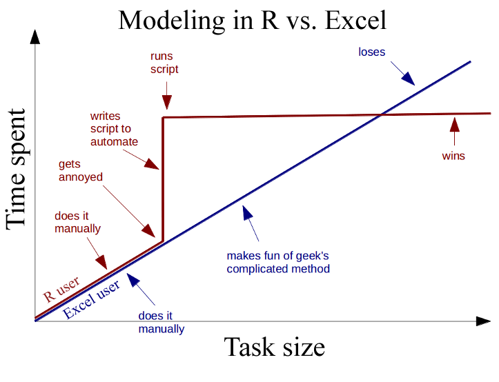
</center>

---

# Wait, why aren't we using Python?

::: {.col}

### The field of choice modeling grew out of Statistics, not Machine Learning

- [Python](https://en.wikipedia.org/wiki/Python_(programming_language)) is a general purpose language developed by [**Guido van Rossum**](https://en.wikipedia.org/wiki/Guido_van_Rossum), a computer scientist.
- Unlike R, Python was not originally developed for data analysis.
- Both languages are extremely useful, and **you should probably learn python too**.

:::

::: {.col}

<center>

</center>

:::

---

# Learning Objectives

### After this class, you will know how to...

- ### ...work with data in 
- ### ...design effective surveys to get rich data
- ### ...analyze consumer choice data to model consumer preferences
- ### ...effectively communicate insights

---

# Course prerequisites

::: {.col width="60%"}

### This course requires prior exposure to:

- ### Probability theory
- ### Multivariable calculus
- ### Linear algebra
- ### Regression
:::

::: {.col .fragment width="40%"}

### **Not sure?**

### Take [this self assessment](https://madd.seas.gwu.edu/2026-Fall/self-assessment.html)

:::

---

# Reflections (30% of grade)

### Do some readings, recorded lectures, practice problems

### Write a short reflection

::: {.fragment}
##  ~Every week (12 total)
:::

::: {.fragment}
##  Due 11:59pm Monday before class
:::

::: {.fragment}
##  Graded for completion (looking for engagement)
:::

---

# **Quizzes** (10% of grade)

::: {.fragment}
##  At the start of class every other week-ish. Make ups only for excused absences (i.e. don't be late).
:::

::: {.fragment}
##  6 total, lowest dropped
:::

::: {.fragment}
##  10 minutes
:::

::: {.fragment}
> **Why quiz at all?** The "retrieval effect" - basically, you have to _practice_ remembering things, otherwise your brain won't remember them (see the book ["Make It Stick: The Science of Successful Learning"](https://www.hup.harvard.edu/catalog.php?isbn=9780674729018))
:::

---

# Exam (10% of grade)

### Take home exam, 2nd to last week of class

### We'll go over exam solutions on last day of class

---

# [Semester Project](https://madd.seas.gwu.edu/2026-Fall/project/0-overview.html) (45% of grade)

::: {.col}

### Teams of 3-4 students

### Goals:

- Assess market viability of a new technology or design
- Recommend best design choices for target market or application

:::

::: {.col}

### Key deliverables:

Item            | Weight | Due
----------------|----------------------------|--------------------
Project Proposal      | 5 %    | Sep. 21
Survey Plan           | 5 %    | Sep. 30
Pilot Survey          | 5 %    | Oct. 14
Pilot Analysis        | 5 %    | Nov. 02
Final Survey          | 5 %    | Nov. 16
Final Analysis Report | 15 %   | Dec. 07
Final Presentation    | 5 %    | Dec. 09

:::

---



# [Grades]{.center}

<center>

</center>

---

# [Grades]{.center}

Item                  | Weight | Notes
----------------------|--------|-------------------------------------
Participation / Attendance | 5%     | (Yes, I take attendance)
Reflections           | 30 %   | Weekly assignment (10 x 3%, lowest dropped)
Quizzes               | 10 %    | 6 quizzes, lowest dropped
Final Exam            | 10 %   | Take home exam
Project Proposal      | 5 %    | Teams of 3-4 students
Survey Plan           | 5 %    |
Pilot Survey          | 5 %    |
Pilot Analysis        | 5 %    |
Final Survey          | 5 %    |
Final Analysis Report | 15 %   |
Final Presentation    | 5 %    |

---

# Course policies

::: {.col .fragment width="35%"}

- ## BE NICE
- ## BE HONEST
- ## DON'T CHEAT

:::

::: {.col .fragment width="65%"}

## [Copying is good, stealing is bad]{.center}

> "Plagiarism is trying to pass someone else's work off as your own. Copying is about reverse-engineering."
>
> [-- Austin Kleon, from [Steal Like An Artist](https://austinkleon.com/steal/)&ensp;]{.right}

:::

---

## Use of chatGPT and other AI tools

<br>

- Large language models (LLMs) are pretty good

. . .

- Sometimes they suck.

. . .

- I will grade whatever you submit. **It should not suck.**

---

## Ways to not have your work suck:

- Don't submit code that doesn't run (actually run it before submitting it).

. . .

- Actually read what the AI generates, and **don't submit something you don't understand**. (Ask the LLM how it works)

. . .

- There are dozens of ways to do things - **you should use the approach I teach**.

. . .

- Ask yourself **"what would I ask Prof. Helveston?"**

. . .

<br>

### **Use AI as an assistant, not a solutions manual**

---



::: {.col width="75%"}

<center>
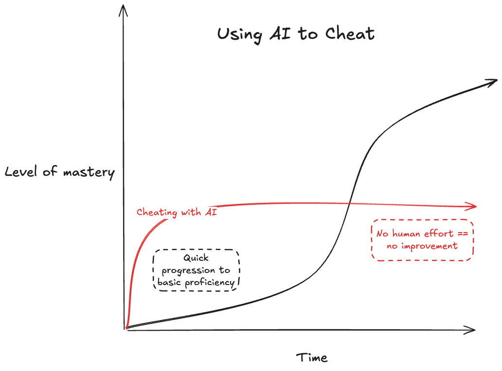
</center>

:::

::: {.col width="25%"}

## [The **wrong** ways to use LLMs]{.center}

Don't copy-paste past the basics - it'll rob you of mastery

:::

---



::: {.col width="75%"}

<center>
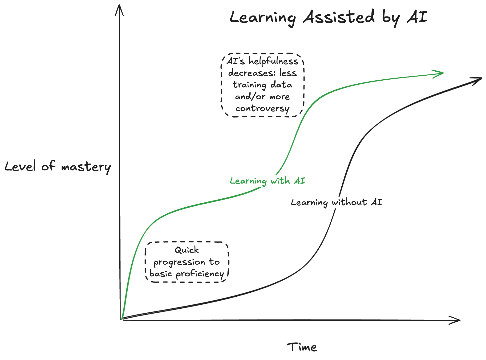
</center>

:::

::: {.col width="25%"}

## [The **right** way to use LLMs]{.center}

- Asking to explain error messages
- Asking to explain _why_ something works or doesn't work

:::

---

# Late submissions

## - **5** late days - use them anytime, no questions asked
## - No more than **2** late days on any one assignment
## - Contact me for special cases

---

# How to succeed in this class

::: {.fragment}
##  Participate during class!
:::

::: {.fragment}
##  Start assignments early and **read carefully**!
:::

::: {.fragment}
##  Get sleep and take breaks often!
:::

::: {.fragment}
##  Ask for help!
:::

---

# Getting Help

::: {.fragment}
##  Use [Slack](https://emse-madd-f26.slack.com/) to ask questions.
:::

::: {.fragment}
##  [Schedule a meeting](https://jhelvy.appointlet.com/b/professor-helveston) w/Prof. Helveston:

- Mondays from 8:00-4:30pm
- Tuesdays from 8:00-4:30pm
- Fridays from 8:00-4:00pm
:::

::: {.fragment}
##  [GW Coders](http://gwcoders.github.io/)
:::

---

```{r}
#| echo: false
#| output: asis
agenda(2)
```

---

::: {.col}

<center>
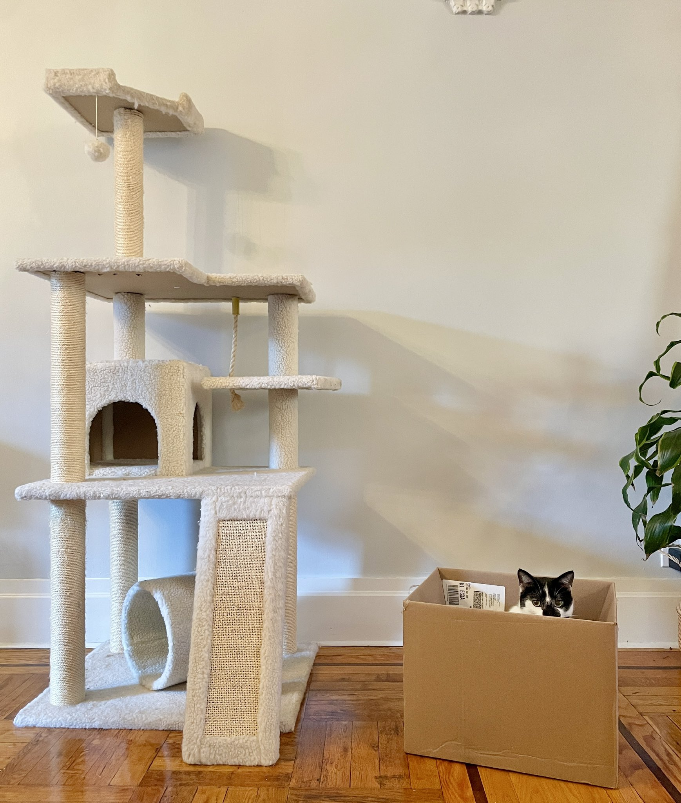
</center>

:::

::: {.col}

# Engineers often design things nobody wants!

:::

---

## We want to answers to questions like...

<br>

. . .

### - Higher prices decrease demand, but by how much?

. . .

### - How much more is a consumer willing to pay for increased performance in X?

. . .

### - How will my product compete against competitors in the market?

. . .

## **Answers depend on knowing what people want**

---



## Directly asking people what they want isn't always helpful

. . .

### (People want everything)

<center>
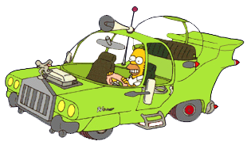
</center>

---




## Which feature do you care more about?

<center>

</center>

::: {.col}

## [Battery Life?]{.center}

<center>
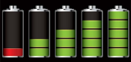
</center>

:::

::: {.col}

## [Brand?]{.center}

<center>

</center>

:::

::: {.col}

## [Signal quality?]{.center}

<center>
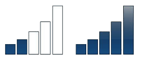
</center>

:::

---



## **Conjoint approach**:<br>Use consumer choice data to model preferences

<center>
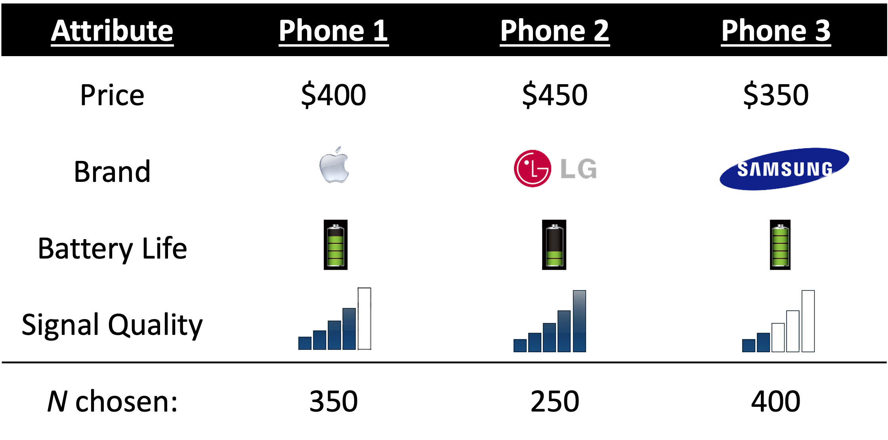
</center>

---

### [Use random utility framework to predict probability of choosing phone _j_]{.center}

<br>

::: {.fragment}
### 1. $u_j = \beta_1\mathrm{price}_j + \beta_2\mathrm{brand}_j + \beta_3\mathrm{battery}_j + \beta_4\mathrm{signal}_j + \varepsilon_j$
:::

::: {.fragment}
### 2. Assume $\varepsilon_j \sim$ iid extreme value
:::

::: {.fragment}
### 3. Probability of choosing phone _j_: $P_j = \frac{e^{\beta'x_j}}{\sum_k^J e^{\beta'x_k}}$
:::

::: {.fragment}
### 4. Estimate $\beta_1$, $\beta_2$, $\beta_3$, $\beta_4$ by minimizing $-L = - \sum_n^N \sum_j^J y_{nj} \ln P_{nj}$
:::

---



::: {.col .center}

## **Willingness to Pay**

<br>

## $u_j = \beta'x_j + \alpha p_j + \varepsilon_j$

## $\omega = \frac{\beta}{-\alpha}$

[Respondents on average are willing to pay $XX to improve battery life by XX%]{.font120}

:::

::: {.col .fragment}

## **Make predictions**

### $P_j = \frac{e^{\hat{\beta}'x_j}}{\sum_k^J e^{\hat{\beta}'x_k}}$

<center>
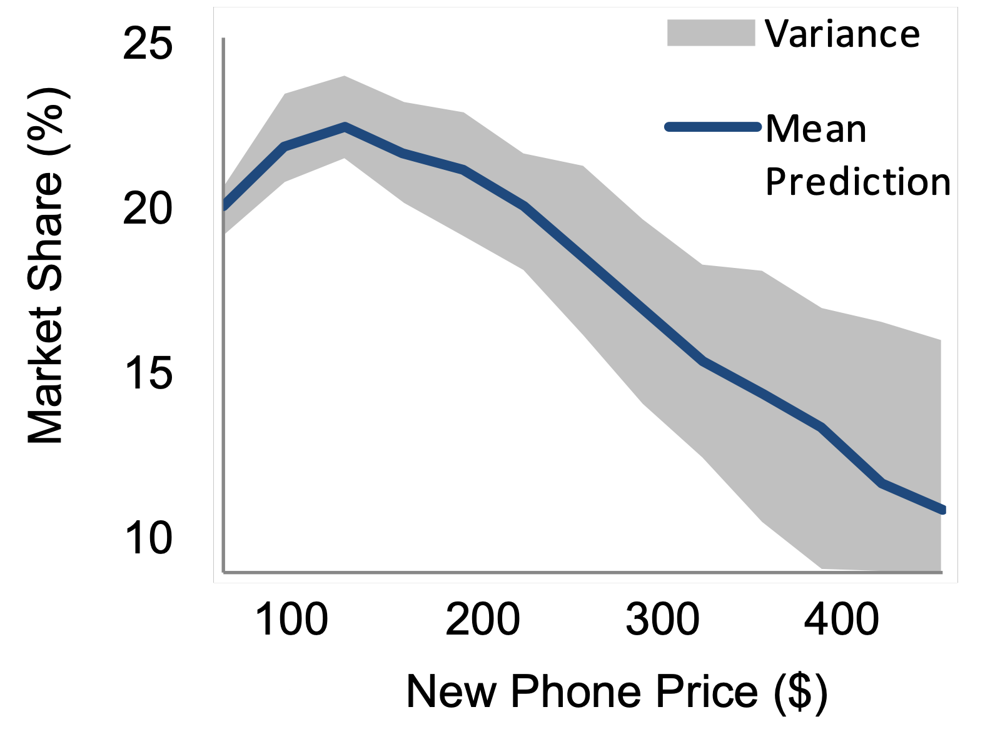
</center>

:::

---





# Example: _Pocket Charge_

## A Flexible, Portable Solar Charger

---



---





### Example survey choice question

<center>
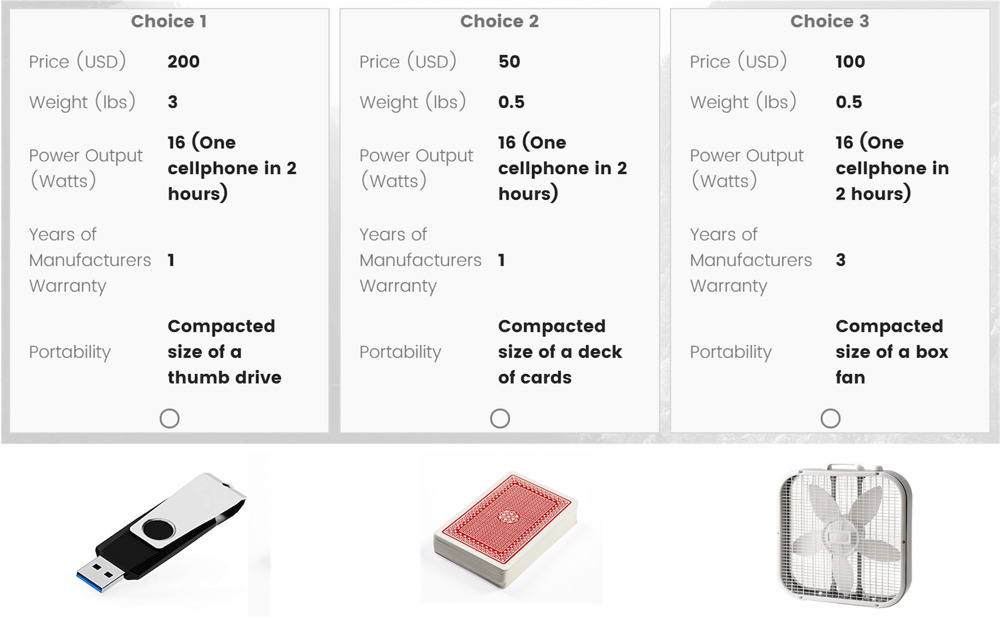
</center>

---



---





# Your project starts now!

# [View projects](https://docs.google.com/presentation/d/1R7GZ4_O6q7xINIlcjiO5CcKSh4V2ZWX3/edit?usp=sharing&ouid=108448693507188860264&rtpof=true&sd=true)

---

```{r}
#| echo: false
#| output: asis
agenda(3)
```

---

# Introduce yourself

## - Preferred name
## - Degree program
## - Prior experience
## - What do you hope to gain from this class?
## - Project interests?

---



<br>

# [[Break]{.fancy}]{.center}

1. If you haven't already, install everything on the [software page](https://madd.seas.gwu.edu/2026-Fall/software.html)

2. Stand up, meet each other, (maybe form teams?...use [this sheet](https://docs.google.com/spreadsheets/d/1bWkSJ7iinHWt4NOPdGYBk2ZxhmhblM1KsDN7Dd1Cwmg/edit?usp=sharing))

```{r}
#| echo: false
countdown(
    minutes = 5,
    warn_when = 30,
    update_every = 1,
    left = 0, right = 0, top = 1, bottom = 0,
    margin = "5%",
    font_size = "8em"
)
```

---

```{r}
#| echo: false
#| output: asis
agenda(4)
```

---




# If you're familiar with R and RStudio,

# download and try out [Positron](https://positron.posit.co/download.html)

---

# RStudio Orientation

::: {.col width="70%"}

<center>
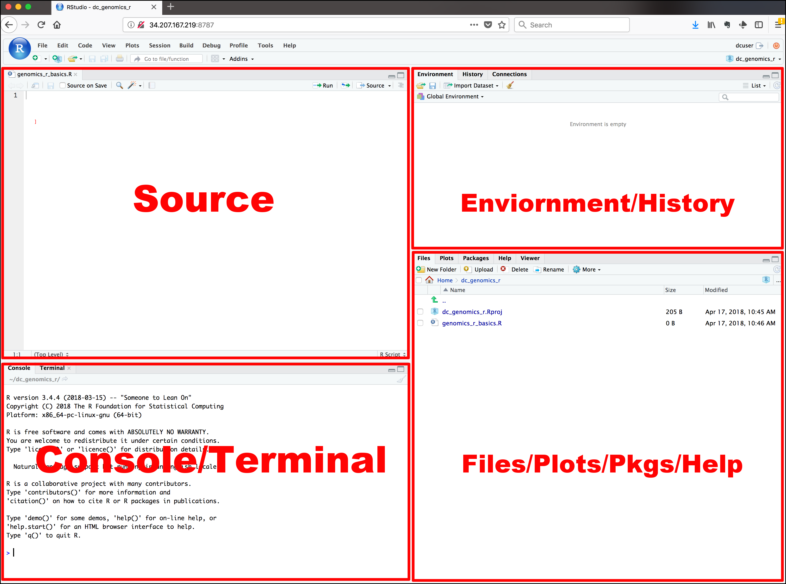
</center>

:::

::: {.col width="30%"}

- Know the boxes
- Customize the layout
- Customize the look
- [Extra themes](https://github.com/gadenbuie/rsthemes)

:::

---





# Open `intro-to-R.R` file and follow along

---

# View prior code in history pane


. . .

# Use "up" arrow see previous code

---

# Staying organized

. . .

## 1) Save your code in .R files

> ### &zwj;File > New File > R Script

. . .

## 2) Keep work in R Project files

> ### File > New Project...

---



```{r}
#| echo: false
countdown(
  minutes      = 10,
  warn_when    = 30,
  update_every = 15,
  bottom       = 0,
  left         = 0,
  font_size    = '2em'
)
```

::: {.col .font80}

## Your turn

### A. Practice getting organized

1. Open RStudio and create a new R project called `week1`.
2. Create a new R script and save it as `practice.R`.
3. Open the `practice.R` file and write your answers to these questions in it.

:::

::: {.col .font80}

### B. Creating & working with objects

1). Create objects to store the values in this table:

| City              | Area   (sq. mi.) | Population (thousands) |
|-------------------|----------------|------------------------|
| San Francisco, CA | 47             | 884                    |
| Chicago, IL       | 228            | 2,716                  |
| Washington, DC    | 61             | 694                    |

2) Using the objects you created, answer the following questions:

  - Which city has the highest density?
  - How many _more_ people would need to live in DC for it to have the same population density as San Francisco?

:::

---





# >15,000 [packages](https://cran.r-project.org/web/packages/available_packages_by_name.html) on the [CRAN](https://cran.r-project.org/)

<center>
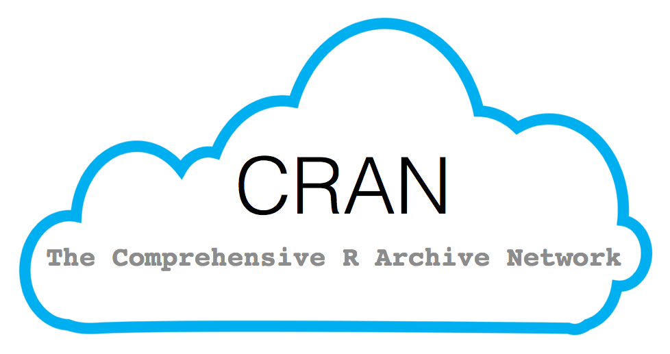
</center>

---

# Installing packages

. . .

### `install.packages("packagename")`
### (The package name **must** be in quotes)

```{r}
#| eval: false
install.packages("packagename") # This works
install.packages(packagename)   # This doesn't work
```

. . .

### **You only need to install a package once!**

---

# Loading packages

. . .

### `library(packagename)`: Loads all the functions in a package
### (The package name _doesn't_ need to be in quotes)

```{r}
#| eval: false
library("packagename") # This works
library(packagename)   # This also works
```

. . .

### **You need to _load_ the package every time you use it!**

---




# Installing vs. Loading

<center>
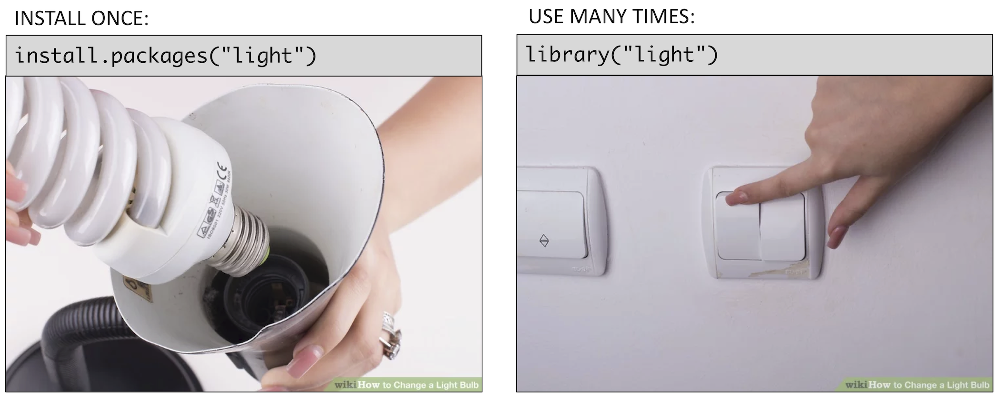
</center>

---

## Example: **wikifacts**

Install the [Wikifacts](https://github.com/keithmcnulty/wikifacts) package, by Keith McNulty:

```{r}
#| eval: false
install.packages("wikifacts")
```

. . .

Load the package:

```{r}
#| eval: false
library(wikifacts) # Load the library
```

. . .

Use one of the package functions

```{r}
#| eval: false
wiki_randomfact()
```

```{r}
#| echo: false
wikifacts::wiki_randomfact()
```

---

## Example: **wikifacts**

Now, restart your RStudio session:
> Session -> Restart R

. . .

Try using the package function again:

```{r}
#| error: true
wiki_randomfact()
```

---

# Using only _some_ package functions

### You don't always have to load the whole library.

. . .

### Functions can be accessed with this pattern:
`packagename::functionname()`

. . .

```{r}
wikifacts::wiki_randomfact()
```

---





## If you haven't yet, install [these packages](https://raw.githubusercontent.com/emse-madd-gwu/2026-Fall/main/content/packages.R)

---





# Back `intro-to-R.R` for the rest of class!
