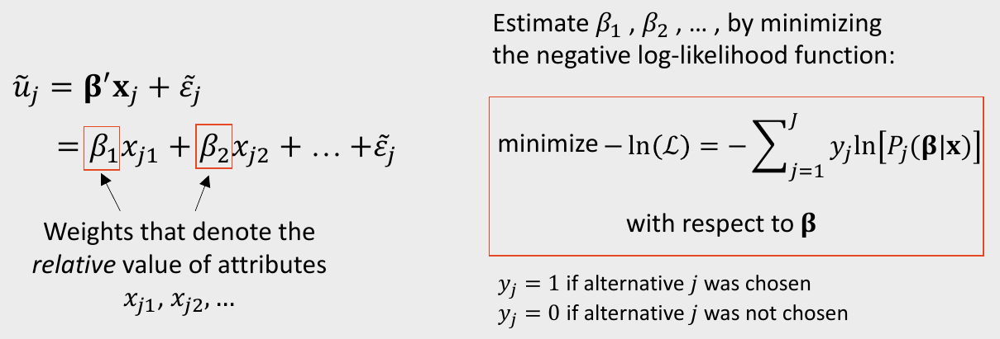
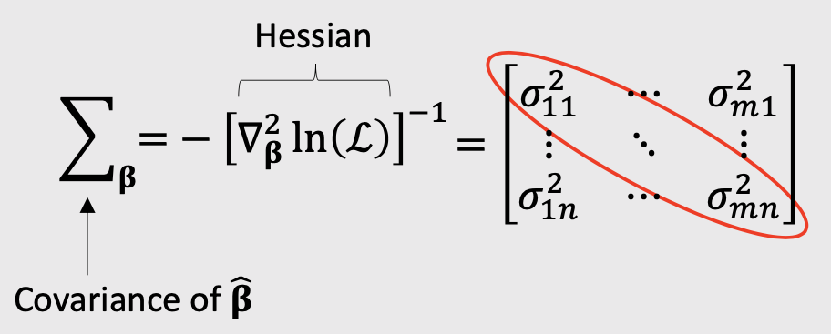
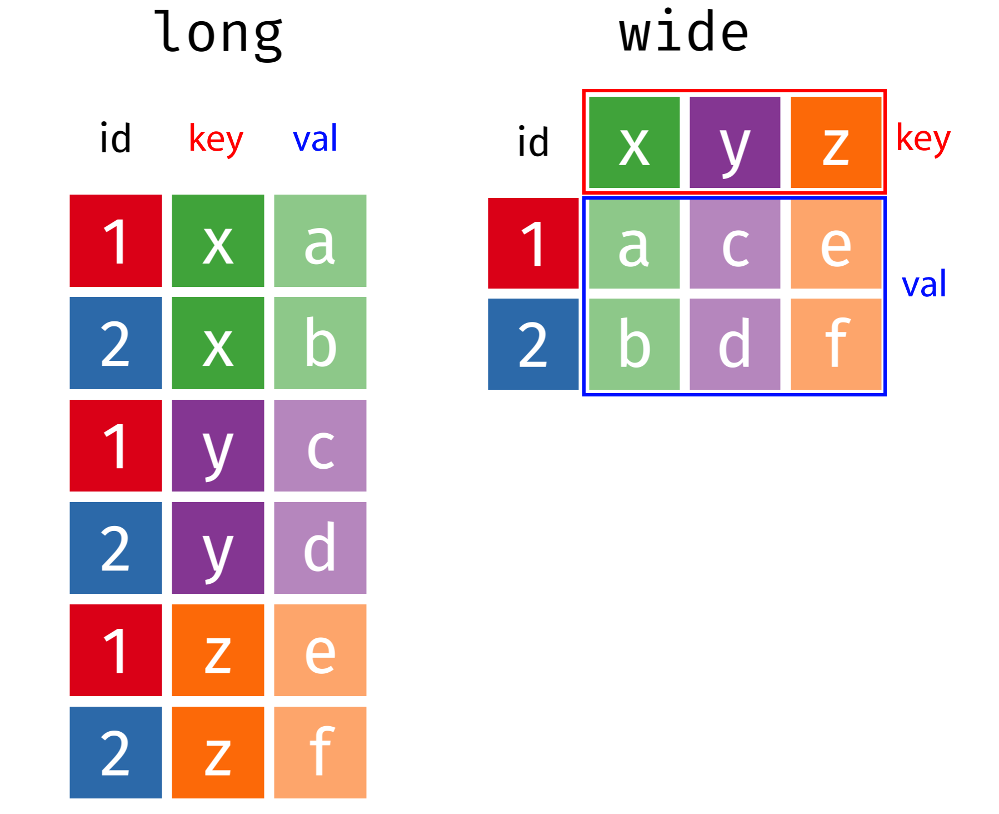
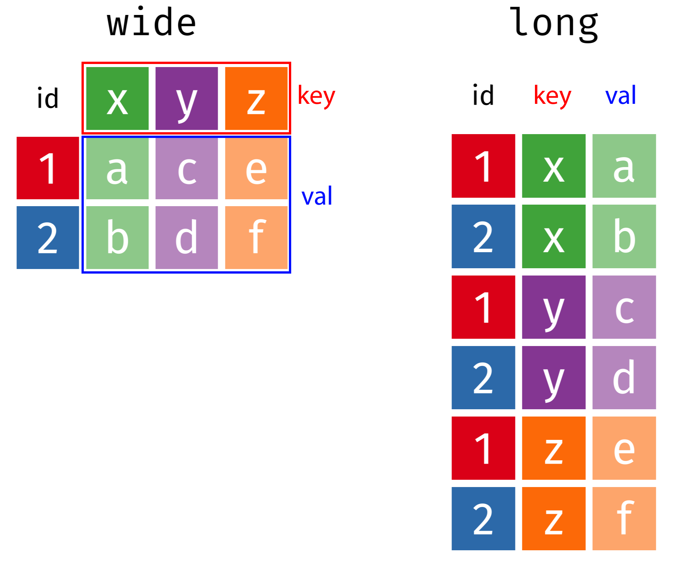



```{r}
#| include: false


# For this class
milk_production  <- read_csv(file.path('data', 'milk_production.csv'))
fed_spend_long <- read_csv(file.path('data', 'fed_spend_long.csv'))
fed_spend_wide <- read_csv(file.path('data', 'fed_spend_wide.csv'))
tb_cases <- read_csv(file.path('data', 'tb_cases.csv'))
lotr_words <- read_csv(file.path('data', 'lotr_words.csv'))

agenda_items <- c(
  "Computing uncertainty",
  "Reshaping data",
  "Cleaning pilot data",
  "Estimating pilot data models"
)
```

---

# [Pilot Analysis Report](https://madd.seas.gwu.edu/2026-Fall/project/4-pilot-analysis.html)

### Due 11/01 (that's 9 days from now)

---

```{r}
#| echo: false
#| output: asis
agenda(0)
```

---

```{r}
#| echo: false
#| output: asis
agenda(1)
```

---




# Maximum likelihood estimation

<center>

</center>

---



<center>

</center>

---





### The _curvature_ of the log-likelihood function is related to the hessian

<center>

</center>

---





### The _curvature_ of the log-likelihood function is related to the hessian

<center>

</center>

---





### Usually report parameter uncertainty ("standard errors") with $\sigma$ values

<center>

</center>

---



# Practice Question 1

Suppose we estimate a model and get the following results:

$$
\hat{\beta} =
\begin{bmatrix}
-0.4
\\
0.5
\end{bmatrix}
$$

$$
\nabla_{\beta}^2 \ln(\mathcal{L}) =
\begin{bmatrix}
-6000 & 60
\\
60 & -700
\end{bmatrix}
$$

a) Use the hessian to compute the standard errors for $\hat{\beta}$

b) Use the standard errors to compute a 95% confidence interval around $\hat{\beta}$

---

# [Simulating uncertainty]{.center}

We can use the coefficients and hessian from a model to obtain draws that reflect parameter uncertainty

::: {.col}

```{r}
beta <- c(-0.7, 0.1, -4.0)

hessian <- matrix(c(
    -6000,   50,   60,
       50, -700,   50,
       60,   50, -300),
    ncol = 3, byrow = TRUE)
```

:::

::: {.col}

```{r}
covariance <- -1*solve(hessian)
draws <- MASS::mvrnorm(10^5, beta, covariance)

head(draws)
```

:::

---

# [Simulating uncertainty]{.center}

We can use the coefficients and hessian from a model to obtain draws that reflect parameter uncertainty

::: {.col}

```{r}
hist(draws[, 1])
```

:::

::: {.col}

```{r}
hist(draws[, 2])
```

:::

::: {.col}

```{r}
hist(draws[, 3])
```

:::

---



# Practice Question 2

::: {.col}

Suppose we estimate the following utility model describing preferences for cars:

$$
u_j = \alpha p_j + \beta_1 x_j^{mpg} + \beta_2 x_j^{elec} + \varepsilon_j
$$

a) Generate 10,000 draws of the model coefficients using the estimated coefficients and hessian. Use the `mvrnorm()` function from the `MASS` library.

b) Use the draws to compute the mean and 95% confidence intervals of each parameter estimate.

:::

::: {.col}

The estimated model produces the following results:

Parameter | Coefficient
----------|------------
$\alpha$ | -0.7
$\beta_1$ | 0.1
$\beta_2$ | -0.4

Hessian:

$$
\begin{bmatrix}
-6000 & 50 & 60
\\
50 & -700 & 50
\\
60 & 50 & -300
\end{bmatrix}
$$

:::

---




## Download the [logitr-cars](https://github.com/jhelvy/logitr-cars/archive/refs/heads/main.zip) repo from GitHub

---

# [Computing and visualizing uncertainty]{.center}

<br>

::: {.col width="80%"}

## 1. Open `logitr-cars`

## 2. Open `code/5.1-uncertainty.R`

:::

---

```{r}
#| echo: false
#| output: asis
agenda(2)
```

---

## [Federal R&D Spending by Department]{.center}

```{r}
#| echo: false
head(fed_spend_wide)
```

---

## [Federal R&D Spending by Department]{.center}

::: {.col .font70 width="60%"}

# "Wide" format

```{r}
#| echo: false
head(fed_spend_wide)
```

:::

::: {.col .fragment .font70 width="40%"}

# "Long" format

```{r}
#| echo: false
head(fed_spend_long)
```

:::

---

## [Federal R&D Spending by Department]{.center}

::: {.col .font70 width="60%"}

# "Wide" format

```{r}
#| echo: false
head(fed_spend_wide)
dim(fed_spend_wide)
```

:::

::: {.col .font70 width="40%"}

# "Long" format

```{r}
#| echo: false
head(fed_spend_long)
dim(fed_spend_long)
```

:::

---

# [Tidy data = "Long" format]{.center}

- Each **variable** has its own **column**
- Each **observation** has its own **row**

<center>

</center>

---

::: {.col}

# Tidy data

- Each **variable** has its own **column**
- Each **observation** has its own **row**

:::

::: {.col}

```{r}
#| echo: false
head(fed_spend_long)
```

:::

<center>

</center>

---

::: {.col .font70 width="40%"}

# "Long" format

```{r}
#| echo: false
head(fed_spend_long)
```

:::

::: {.col .font70 width="60%"}

# "Wide" format

```{r}
#| echo: false
head(fed_spend_wide)
```

:::

---

# [**Do the names describe the values?**]{.center}

::: {.col .font70 width="40%"}

## **Yes**: "Long" format

```{r}
#| echo: false
head(fed_spend_long)
```

:::

::: {.col .font70 width="60%"}

## **No**: "Wide" format

```{r}
#| echo: false
head(select(fed_spend_wide, year:HHS))
```

:::

---

# **Quick practice 1**: "long" or "wide" format?

**Description**: Tuberculosis cases in various countries

::: {.font100}
```{r}
#| echo: false
tb_cases
```
:::

---

# **Quick practice 2**: "long" or "wide" format?

**Description**: Word counts in LOTR trilogy

::: {.font90}
```{r}
#| echo: false
lotr_words
```
:::

---

# **Quick practice 3**: "long" or "wide" format?

**Description**: Word counts in LOTR trilogy

```{r}
#| echo: false
lotr_words %>%
    pivot_longer(
        cols = Female:Male,
        names_to = "Gender",
        values_to = "Word_Count"
    ) %>%
    head(15)
```

---





# Reshaping data with

## `pivot_longer()` and `pivot_wider()`

---



::: {.col width="40%"}

# Reshaping data

## `pivot_longer()`<br>`pivot_wider()`

:::

::: {.col width="60%"}

<center>

</center>

:::

---

## [From "long" to "wide" with `pivot_wider()`]{.center}

<center>

</center>

---

## [From "long" to "wide" with `pivot_wider()`]{.center}

::: {.col width="45%"}

```{r}
head(fed_spend_long)
```

:::

::: {.col width="55%"}

```{r}
#| code-line-numbers: "3,4"
fed_spend_wide <- fed_spend_long %>%
    pivot_wider(
        names_from = department,
        values_from = rd_budget_mil)

head(fed_spend_wide)
```

:::

---

## [From "wide" to "long" with `pivot_longer()`]{.center}

<center>

</center>

---

## [From "wide" to "long" with `pivot_longer()`]{.center}

::: {.col width="45%"}

```{r}
head(fed_spend_wide)
```

:::

::: {.col width="55%"}

```{r}
#| code-line-numbers: "3,4,5"
fed_spend_long <- fed_spend_wide %>%
    pivot_longer(
        names_to = "department",
        values_to = "rd_budget_mil",
        cols = DOD:Other)

head(fed_spend_long)
```

:::

---

## Can also set `cols` by selecting which columns _not_ to use

::: {.col width="45%"}

```{r}
names(fed_spend_wide)
```

:::

::: {.col width="55%"}

```{r}
#| code-line-numbers: "5"
fed_spend_long <- fed_spend_wide %>%
    pivot_longer(
        names_to = "department",
        values_to = "rd_budget_mil",
        cols = -year)

head(fed_spend_long)
```

:::

---



```{r}
#| echo: false
countdown(
    minutes      = 15,
    warn_when    = 15,
    update_every = 1,
    top          = 0,
    right        = 0,
    font_size    = '2em'
)
```

# Your turn: Reshaping Data

Open the `practice.Rmd` file.

Run the code chunk to read in the following two data files:

- `pv_cell_production.xlsx`: Data on solar photovoltaic cell production by country
- `milk_production.csv`: Data on milk production by state

Now modify the format of each:

- If the data are in "wide" format, convert it to "long" with `pivot_longer()`
- If the data are in "long" format, convert it to "wide" with `pivot_wider()`

---




# [Break]{.fancy}

```{r}
#| echo: false
countdown(
    minutes      = 5,
    warn_when    = 30,
    update_every = 1,
    left         = 0, right = 0, top = 1, bottom = 0,
    margin       = "5%",
    font_size    = "8em"
)
```

---

```{r}
#| echo: false
#| output: asis
agenda(3)
```

---




## Download the [demo-choice-based-conjoint](https://github.com/surveydown-dev/demo-choice-based-conjoint/archive/refs/heads/main.zip) repo

---

# [Cleaning surveydown survey data]{.center}

<br>

::: {.col width="80%"}

## 1. Open the `survey` folder in Positron

## 2. Open `code/data_cleaning.R`

:::

---



```{r}
#| echo: false
countdown(
    minutes = 20,
    warn_when = 15,
    update_every = 1,
    top = 0,
    right = 0,
    font_size = '2em'
)
```

# Your Turn

## As a team, pick up where you left off last week and create a `choiceData` data frame in a "long" format

---

```{r}
#| echo: false
#| output: asis
agenda(4)
```

---

# [Estimating pilot data models]{.center}

<br>

::: {.col width="80%"}

## 1. Open the `survey` folder in Positron

## 2. Open `code/modeling.R`

:::

---



# Your Turn

## As a team:

1. Use your `choiceData` data frame to estimate preliminary choice models.
2. Interpret your model coefficients **with uncertainty**.
