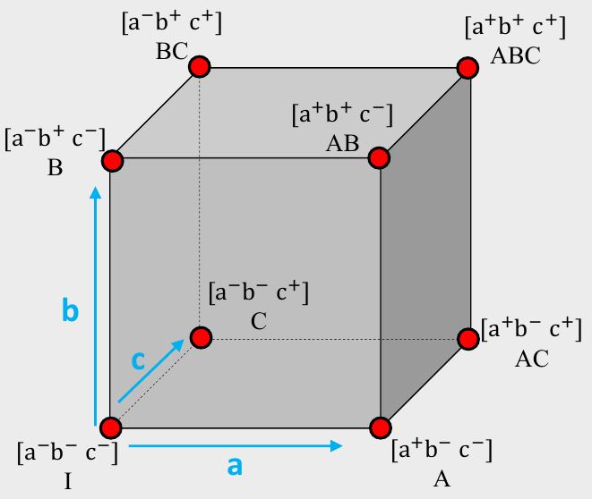
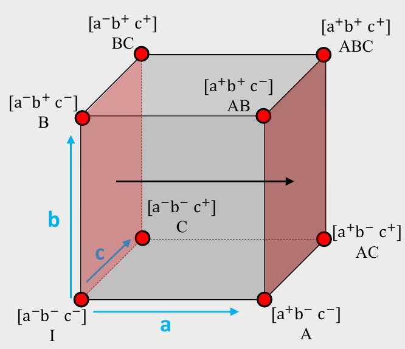
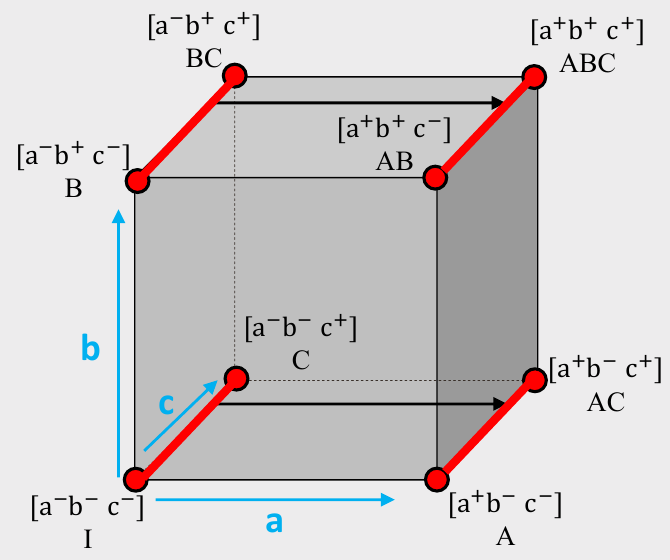



```{r}
#| include: false

agenda_items <- c(
  "Design of Experiment",
  "Design Efficiency",
  "Power Analysis"
)
```

---



# Quiz 4

```{r}
#| echo: false
countdown(
  minutes      = 12,
  warn_when    = 30,
  update_every = 1,
  top          = 0,
  right        = 0,
  font_size    = '3em'
)
```

::: {.col}

## Write your name on the quiz!

## Rules:

- Work alone; no outside help of any kind is allowed.
- No calculators, no notes, no books, no computers, no phones.

:::

::: {.col}

<br>
<center>

</center>

:::

---

```{r}
#| echo: false
#| output: asis
agenda(0)
```

---

```{r}
#| echo: false
#| output: asis
agenda(1)
```

---





# Main & Interaction Effects

---



# [Full design space for 3 effects: A, B, C]{.center}

<center>

</center>

---



# [Full design space for 3 effects: A, B, C]{.center}

::: {.col}

# Example: _Cars_

## A: Electric? (Yes+ or No-)
## B: Warranty? (Yes+ or No-)
## C: Ford? (Yes+ or No-)

:::

::: {.col}

<center>

</center>

:::

---




## Main Effects

::: {.col width="40%"}

$$
ME(a) =
$$

$$
\left( \frac{A + AB + AC + ABC}{4}\right) -
$$

$$
\left( \frac{I + B + C + BC}{4}\right)
$$

<br>

(A: Electric? Yes+ or No-)

:::

::: {.col width="60%"}

<center>

</center>

:::

---




## Interaction Effects

::: {.col}

$$
INT(ab) =
$$

$$
\frac{1}{2}\left[ \left( \frac{AB + ABC}{2}\right) - \left( \frac{B + BC}{2}\right) \right] -
$$

$$
\frac{1}{2}\left[ \left( \frac{A + AC}{2}\right) - \left( \frac{I + C}{2}\right) \right]
$$

:::

::: {.col}

<center>

</center>

:::

---

# [Example: Wine Pairings]{.center}

::: {.col width="40%"}

meat | wine
-----|------
fish | white
fish | red
steak | white
steak | red

:::

::: {.col .fragment width="60%"}

## Main Effects

1. `meat`: **Fish** or **Steak**?
2. `wine`: **Red** or **White**?

:::

---

# [Example: Wine Pairings]{.center}

::: {.col width="40%"}

meat | wine
-----|------
fish | white
fish | red
steak | white
steak | red

:::

::: {.col width="60%"}

## Main Effects

1. `meat`: **Fish** or **Steak**?
2. `wine`: **Red** or **White**?

## Interaction Effects

1. `meat*wine`: **Red** or **White** wine _with **Steak**_?
2. `meat*wine`: **Red** or **White** wine _with **Fish**_?

:::

---




# Open `interactions.qmd`

---





# Fractional vs Full Factorial Designs

---

## [Full Factorial Design]{.center}

::: {.col}

## Example: _Cars_

## A: Electric? (Yes+ or No-)
## B: Warranty? (Yes+ or No-)
## C: Ford? (Yes+ or No-)

:::

::: {.col}

```{r}
library(cbcTools)

profiles <- cbc_profiles(
    electric = c(1, 0),
    warranty = c(1, 0),
    ford     = c(1, 0)
)
```

```{r}
#| eval: false

profiles
```

```{r}
#| echo: false

data.frame(profiles)
```

:::

---

## [Full Factorial Design]{.center}

::: {.col}

## Balanced?

All levels appear an equal number of times.

## Orthogonal?

All pairs of levels appear together an equal number of times.

:::

::: {.col}

```{r}
library(cbcTools)

profiles <- cbc_profiles(
    electric = c(1, 0),
    warranty = c(1, 0),
    ford     = c(1, 0)
)
```

```{r}
#| eval: false

profiles
```

```{r}
#| echo: false

data.frame(profiles)
```

:::

---

## [Fractional Factorial Design]{.center}

::: {.col}

## Balanced?

All levels appear an equal number of times.

## Orthogonal?

All pairs of levels appear together an equal number of times.

:::

::: {.col}

```{r}
#| eval: false

profiles[c(1, 3, 5, 6),]
```

```{r}
#| echo: false

data.frame(profiles[c(1, 3, 5, 6),])
```

:::

---




# Comparing Full and Fractional Factorial Designs

# Open `balance-orthogonality.qmd`

---



# Practice Question 1

::: {.col}

Consider the following experiment design

a | b | c | Effect
--|---|---|-------
+ | - | - | A
- | + | - | B
+ | - | + | AC
- | + | + | BC

:::

::: {.col}

a) Is the design balanced? Is is orthogonal?

b) Write out the equation to compute the main effect for a, b, and c.

c) Are any main effects confounded? If so, what are they confounded with?

:::

---

```{r}
#| echo: false
#| output: asis
agenda(2)
```

---

# [A simple conjoint experiment about _cars_]{.center}

Attribute | Levels
----------|----------
Brand     | GM, BMW, Ferrari
Price     | $20k, $40k, $100k

[**Design: [9]{.red} choice sets, [3]{.blue} alternatives each**]{.center}

. . .

::: {.col}

```
Attribute counts:

brand:
  GM   BMW  Ferrari
  10    11    6

price:

 20k  40k 100k
  9    9   9
```

:::

::: {.col .fragment}

```
Pairwise attribute counts:

brand & price:

          20k 40k 100k
  GM        3   0    7
  BMW       4   5    2
  Ferrari   2   4    0
```

:::

---

# [A simple conjoint experiment about _cars_]{.center}

Attribute | Levels
----------|----------
Brand     | GM, BMW, Ferrari
Price     | $20k, $40k, $100k

[**Design: [90]{.red} choice sets, [3]{.blue} alternatives each**]{.center}

. . .

::: {.col}

```
Attribute counts:

brand:
  GM    BMW   Ferrari
  92    80     98

price:

  20k  40k 100k
  91   84   95
```

:::

::: {.col .fragment}

```
Pairwise attribute counts:

brand & price:

          20k 40k 100k
  GM      31  31  30
  BMW     25  25  30
  Ferrari 35  28  35
```

:::

---

# [Bayesian D-efficient designs]{.center}

### [Maximize information on "Main Effects" according to priors]{.center}

. . .

Attribute | Levels | Prior
----------|-------------------|----------
Brand     | GM, BMW, Ferrari  | 0, 1, 2
Price     | $20k, $40k, $100k | 0, -1, -4

$$v_j = 1 \delta^{\mathrm{BMW}} + 2 \delta^{\mathrm{Ferrari}} -1 \delta^{\mathrm{40k}} -4 \delta^{\mathrm{100k}}$$

---

# [Bayesian D-efficient designs]{.center}

### [Maximize information on "Main Effects" according to priors]{.center}

Attribute | Levels | Prior
----------|-------------------|----------
Brand     | GM, BMW, Ferrari  | 0, 1, 2
Price     | $20k, $40k, $100k | 0, -1, -4

::: {.col}

```
Attribute counts:

brand:
  GM    BMW   Ferrari
  93    90     86

price:

  20k  40k 100k
  97   93   78
```

:::

::: {.col .fragment}

```
Pairwise attribute counts:

brand & price:

          20k 40k 100k
  GM      52  41  0
  BMW     30  30  30
  Ferrari 15  22  49
```

:::

---



### Negative of the hessian evaluated at a set of parameters is called the **"Information Matrix"**

## $$\boldsymbol{I}(\boldsymbol{\beta}) = - \nabla_{\boldsymbol{\beta}}^2 \ln (\mathcal{L})$$

---



## "D-optimal" designs attempt to minimize the<br>"D-error" of a design

## $$D = |\boldsymbol{I}(\boldsymbol{\beta})| ^{-1/p}$$

where $p$ is the number of coefficients in the model

---




# Finding Efficient Designs

# Open `design-efficiency.qmd`

---



```{r}
#| echo: false
countdown(
  minutes = 20,
  warn_when = 15,
  update_every = 1,
  top = 0,
  right = 0,
  font_size = '2em'
)
```

## Your Turn

1. Individually, create a Bayesian D-efficient fractional factorial survey design. Inspect the attribute balance and overlap.

2. Compare your results with your teammates.

---

```{r}
#| echo: false
#| output: asis
agenda(3)
```

---




# How many respondents do I need?

---




# How many respondents do I need<br>_to get X level of precision on $\boldsymbol{\beta}$_?

---

# Standard errors are inversely related to $\sqrt{N}$

::: {.col}

```{r}
#| label: uncertainty
#| fig-show: hide
n <- seq(100)
se <- 1/sqrt(n)
plot(n, se, type = "l")
```

Standard errors also decrease with:

- Fewer attributes
- Fewer levels in each categorical attribute
- More questions per respondent

:::

::: {.col}

```{r}
#| ref-label: uncertainty
#| echo: false
#| fig-height: 4.5
#| fig-width: 6
```

:::

---




## Using {cbcTools}, we can run simulations to determine the necessary sample size for a specific model

# Open `power-analysis.qmd`

---



```{r}
#| echo: false
countdown(
  minutes = 20,
  warn_when = 15,
  update_every = 1,
  top = 0,
  right = 0,
  font_size = '2em'
)
```

## Your Turn

::: {.col width="80%"}

Individually:

1. Using the survey design you created in the last practice, conduct a power analysis to determine the necessary sample size to achieve a 0.05 significance level on your parameter estimates.

2. Compare your results with your teammates.

:::
