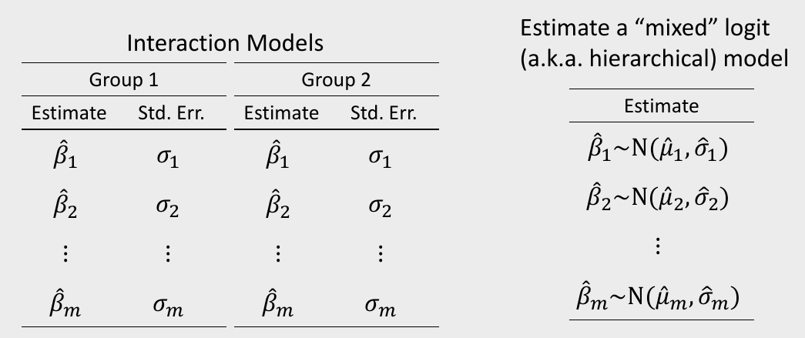
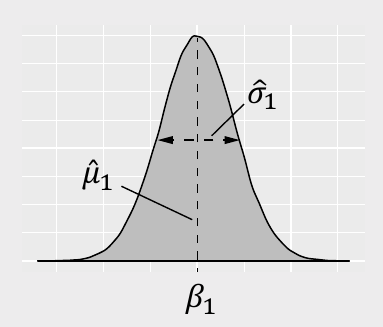



```{r}
#| include: false

agenda_items <- c(
  "Mixed logit (unobserved heterogeneity)",
  "Sub-group modeling (observed heterogeneity)"
)
```

---



# Quiz 5 - last one!

```{r}
#| echo: false
countdown(
  minutes      = 12,
  warn_when    = 30,
  update_every = 1,
  top          = 0,
  right        = 0,
  font_size    = '3em'
)
```

::: {.col}

## Write your name on the quiz!

## Rules:

- Work alone; no outside help of any kind is allowed.
- No calculators, no notes, no books, no computers, no phones.

:::

::: {.col}

<br>
<center>

</center>

:::

---

# Houskeeping items

::: {.incremental}
- **Final presentations** will be on 12/10 during normal class hours. You can pre-record a video presentation if you want, or you can do it live.
- [**Final Surveys**](https://madd.seas.gwu.edu/2026-Fall/project/5-final-survey.html) are due 11/15 (this Sunday!). **They need to be fully working**
- [**Final Analysis**](https://madd.seas.gwu.edu/2026-Fall/project/6-final-analysis.html) (due 12/06) will also be an html page report.
- I am planning on posting all final analyses (without grades) to the course site as a showcase for future students - **please DM me if you would NOT like your report posted**. ([examples](https://madd.seas.gwu.edu/showcase) from last year)
:::

---

```{r}
#| echo: false
#| output: asis
agenda(0)
```

---

```{r}
#| echo: false
#| output: asis
agenda(1)
```

---




# Two ways of modeling heterogeneity

::: {.col}

[_"Observed Heterogeneity"_]{.red}

:::

::: {.col}

[_"Unobserved Heterogeneity"_]{.red}

:::

<center>

</center>

---



## [Mixed logit]{.center}

### Preference parameters follow a distribution<br>**across sample population**

::: {.col}

<center>

</center>

:::

::: {.col}

## $$\tilde{u}_j = \beta_1 x_j + \varepsilon_j$$

## $$\beta_1 \sim \mathrm{N} (\mu_1, \sigma_1)$$

Parameter | Estimate | Standard Error
----------|----------|-----------------
$\mu_1$   | 0.1      | 0.01
$\sigma_1$ | 0.1      | 0.01

:::

---

## Which distribution should I use?

::: {.col}

**Normal distribution**

When preferences can be positive or negative

e.g. `brand = "n"`

```{r}
#| echo: false
x <- seq(0, 3, 0.01)
data.frame(
  x = x,
  y = dnorm(x, 1.5, 0.5)) %>%
  ggplot() +
  geom_line(aes(x = x, y = y)) +
  theme_bw() +
  labs(x = "brand")
```

:::

::: {.col .fragment}

**Log-normal distribution**

When preferences should be strictly positive

e.g. `-1*price = "ln"`

```{r}
#| echo: false
x <- seq(0, 3, 0.01)
data.frame(
  x = x,
  y = dlnorm(x, 0, 0.4)) %>%
  ggplot() +
  geom_line(aes(x = x, y = y)) +
  theme_bw() +
  labs(x = "price")
```

:::

::: {.col .fragment}

**Fixed parameter**

When preferences appear to be homogeneous

(e.g. $\sigma$ is very small)

```{r}
#| echo: false
x <- seq(0, 3, 0.01)
data.frame(
  x = x,
  y = dnorm(x, 1.5, 0.1)) %>%
  ggplot() +
  geom_line(aes(x = x, y = y)) +
  theme_bw() +
  labs(x = "brand")
```

:::

---



### Mixed logits are not equivalent in Preference vs. WTP space

::: {.col}

### Preference space

### $$\tilde{u}_j = \alpha p_j + \beta x_j + \varepsilon_j$$

### $$\alpha \sim \ln\mathrm{N} (\mu_1, \sigma_1)$$

### $$\beta \sim \mathrm{N} (\mu_2, \sigma_2)$$

:::

---



### Mixed logits are not equivalent in Preference vs. WTP space

::: {.col}

### Preference space

### $$\tilde{u}_j = \alpha p_j + \beta x_j + \varepsilon_j$$

### $$\alpha \sim \ln\mathrm{N} (\mu_1, \sigma_1)$$

### $$\beta \sim \mathrm{N} (\mu_2, \sigma_2)$$

### $$\omega = \frac{\beta}{-\alpha} = \frac{\mathrm{N} (\mu_2, \sigma_2)}{- \ln\mathrm{N} (\mu_1, \sigma_1)}$$

:::

::: {.col .fragment}

### WTP space

### $$\tilde{u}_j = \lambda(\omega_1 x_j - p_j) + \varepsilon_j$$

### $$\omega_1 \sim \mathrm{N} (\mu_1, \sigma_1)$$

:::

---



# Practice Question 3

a) Use the `logitr` package to estimate the following homogeneous model:

$$
\tilde{u}_j = \beta_1 x_j^{\mathrm{price}} + \beta_2 \delta_j^{\mathrm{feat}} + \beta_3 \delta_j^{\mathrm{dannon}} + \beta_4 \delta_j^{\mathrm{hiland}} +
\beta_5 \delta_j^{\mathrm{weight}} + \varepsilon_j
$$

where the three $\delta$ coefficients are dummy variables for Dannon, Hiland, and Weight Watchers brands (Yoplait is the reference level).

b) Use the `logitr` package to estimate the same model but with the following mixing distributions:

- $\beta_1 \sim \mathrm{N} (\mu_1, \sigma_1)$
- $\beta_2 \sim \mathrm{N} (\mu_2, \sigma_2)$

---

# [Estimating mixed logit models with `logitr`]{.center}

<br>

::: {.col width="80%"}

## 1. Open `logitr-cars`

## 2. Open `code/8.1-model-mxl.R`

:::

---



```{r}
#| echo: false
countdown(minutes = 10, warn_when = 15, update_every = 1, top = 0, right = 0, font_size = '2em')
```

## Your Turn

::: {.col .font120 width="80%"}

As a team, re-estimate the main model you used in your pilot analysis report, but now using a mixed logit model.

Carefully consider which distributions to use (i.e., normal or log-normal) for different variables.

:::

---

```{r}
#| echo: false
#| output: asis
agenda(2)
```

---



# Two ways of modeling heterogeneity

::: {.col}

[_"Observed Heterogeneity"_]{.red}

:::

::: {.col}

[_"Unobserved Heterogeneity"_]{.red}

:::

<center>

</center>

---



### [Use interactions to model preferences for multiple groups]{.center}

::: {.col}

### Homogenous model:

### $\tilde{u}_j = \beta_1 x_j + \varepsilon_j$

### Two groups: A & B

### $\tilde{u}_j = \beta_1 x_j + \beta_2 x_j \delta^\mathrm{B} + \varepsilon_j$

### $\quad = (\beta_1 + \beta_2 \delta^\mathrm{B}) x_j + \varepsilon_j$

:::

::: {.col}

Par.| Meaning
----|--------
$\beta_1$ | Effect of $x_j$ for group A
$\beta_2$ | _Difference_ in effect of $x_j$ between groups

:::

---



# What's the difference?

::: {.col}

## Separate models []{.red}

$$
\tilde{u}_j^\mathrm{A} = \beta_1^\mathrm{A} x_j + \varepsilon_j^\mathrm{A}
$$

$$
\tilde{u}_j^\mathrm{B} = \beta_1^\mathrm{B} x_j + \varepsilon_j^\mathrm{B}
$$

:::

::: {.col}

## Single model []{.green}

$$\tilde{u}_j = \beta_1 x_j + \beta_2 x_j \delta^\mathrm{B} + \varepsilon_j$$

:::

---

# [Accounting for scale differences]{.center}

::: {.col}

## [Separate models []{.red}]{.center}

$$
\tilde{u}_j^\mathrm{A} = \alpha^\mathrm{A} p_j + \beta_1^\mathrm{A} x_j + \varepsilon_j^\mathrm{A}
$$

$$
\tilde{u}_j^\mathrm{B} = \alpha^\mathrm{B} p_j + \beta_1^\mathrm{B} x_j + \varepsilon_j^\mathrm{B}
$$

Imagine you got the following results

- $\hat{\alpha}^\mathrm{A}$ = 100
- $\hat{\beta}^\mathrm{A}$ = 200
- $\hat{\alpha}^\mathrm{B}$ = 1
- $\hat{\beta}^\mathrm{B}$ = 2

:::

::: {.col .fragment}

## [Single model []{.green}]{.center}

$$\tilde{u}_j = \alpha_1 p_j + \alpha_2 p_j \delta^\mathrm{B} + \beta_1 x_j + \beta_2 x_j \delta^\mathrm{B} + \varepsilon_j$$

$$\quad = (\alpha_1 + \alpha_2 \delta^\mathrm{B}) p_j + (\beta_1 + \beta_2 \delta^\mathrm{B}) x_j + \varepsilon_j$$

:::

---

# [Accounting for scale differences]{.center}

::: {.col}

## [Preference Space []{.red}]{.center}

$$
\tilde{u}_j^\mathrm{A} = \alpha^\mathrm{A} p_j + \beta_1^\mathrm{A} x_j + \varepsilon_j^\mathrm{A}
$$

$$
\tilde{u}_j^\mathrm{B} = \alpha^\mathrm{B} p_j + \beta_1^\mathrm{B} x_j + \varepsilon_j^\mathrm{B}
$$

Imagine you got the following results

- $\hat{\alpha}^\mathrm{A}$ = 100
- $\hat{\beta}^\mathrm{A}$ = 200
- $\hat{\alpha}^\mathrm{B}$ = 1
- $\hat{\beta}^\mathrm{B}$ = 2

:::

::: {.col .fragment}

## [WTP Space []{.green}]{.center}

$$
\tilde{u}_j^\mathrm{A} = \lambda^\mathrm{A}(\omega_1^\mathrm{A} x_j - p) + \varepsilon_j^\mathrm{A}
$$

$$
\tilde{u}_j^\mathrm{B} = \lambda^\mathrm{B}(\omega_1^\mathrm{B} x_j - p) + \varepsilon_j^\mathrm{B}
$$

$$
\omega = \frac{\beta}{- \alpha}
$$

- $\hat{\omega}^\mathrm{A} = 200 / (-100) = -2$
- $\hat{\omega}^\mathrm{B} = 2 / (-1) = -2$

:::

---



# Practice Question 1

Suppose we estimate the following utility model describing preferences for cars:

$$
\tilde{u}_j = \beta_1 x_j^{\mathrm{price}} + \beta_2 x_j^{\mathrm{mpg}} + \beta_3 x_j^{\mathrm{elec}} + \varepsilon_j
$$

a) Using interactions, write out a model that accounts for differences in the effects of $x_j^{\mathrm{price}}$, $x_j^{\mathrm{mpg}}$, and $x_j^{\mathrm{elec}}$ between two groups: A and B.

b) Write out the effects of $x_j^{\mathrm{price}}$, $x_j^{\mathrm{mpg}}$, and $x_j^{\mathrm{elec}}$ for each group.

---



# Practice Question 2

Suppose we estimate the following utility model describing preferences for chocolate bars between two groups: A & B

$$
\tilde{u}_j = \beta_1 x_j^{\mathrm{price}} + \beta_2 x_j^{\mathrm{caco}} + \beta_3 x_j^{\mathrm{price}}\delta_j^{\mathrm{B}} + \beta_4 x_j^{\mathrm{cacao}}\delta_j^{\mathrm{B}} + \varepsilon_j
$$

::: {.col width="55%"}

The estimated model produces the following coefficients and hessian:

$\beta$ = [-0.7, 0.1, 0.2, 0.8]

$$
H =
\begin{bmatrix}
-6000 & 50 & 60 & 70
\\
50 & -700 & 50 & 100
\\
60 & 50 & -300 & 20
\\
70 & 100 & 20 & -6000
\end{bmatrix}
$$

:::

::: {.col width="45%"}

a) Use the `mvrnorm()` function from the `MASS` library to generate 10,000 draws of the model coefficients.

b) Use the draws to compute the mean WTP and 95% confidence intervals of the effects of $x_j^{\mathrm{price}}$ and $x_j^{\mathrm{cacao}}$ for each group (A & B).

:::

---

# [Estimating mixed logit models with `logitr`]{.center}

<br>

## 1. Open `logitr-cars`

## 2. Open `code/8.2-model-mnl-groups.R`

---



```{r}
#| echo: false
countdown(minutes = 20, warn_when = 15, update_every = 1, top = 0, right = 0, font_size = '2em')
```

## Your Turn

### Do this individually, and compare with your teammates:

::: {.col .font120 width="80%"}

- Examine the demographic and other variables in your pilot data and specify a model that estimates differences between different groups.
- Write code to estimate that model (or multiple models, e.g. WTP space models).
- Compute and compare WTP across the different groups.

:::
