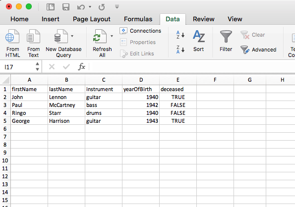
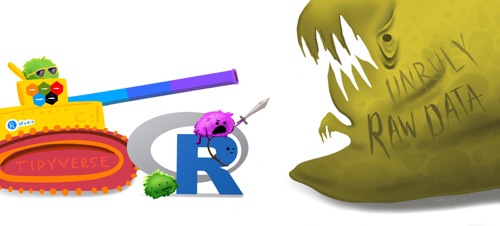
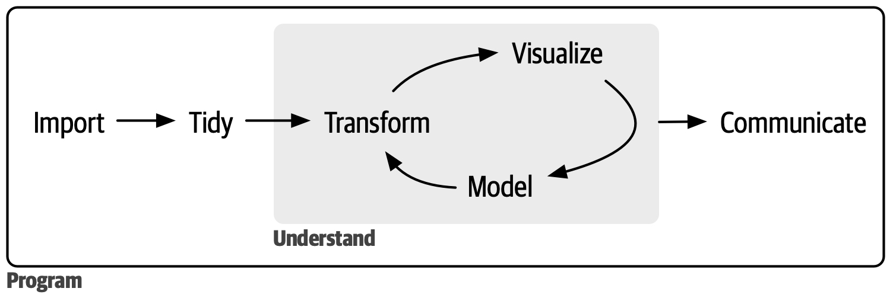
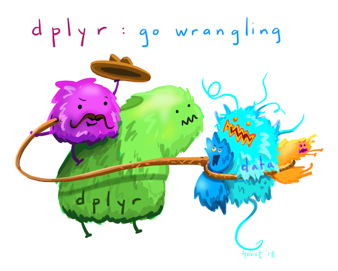
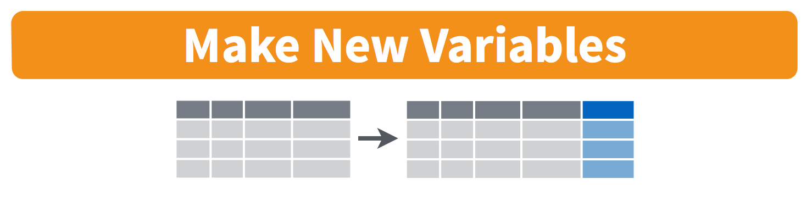
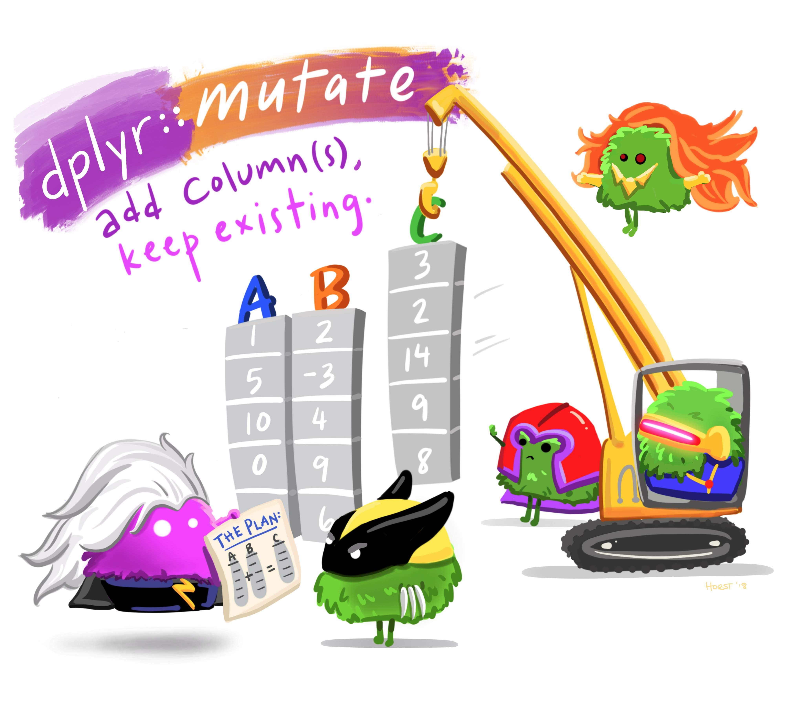
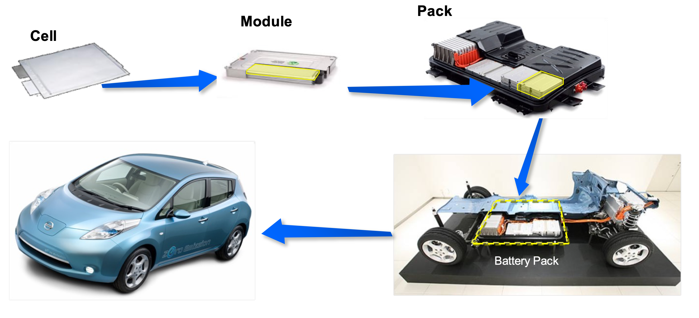
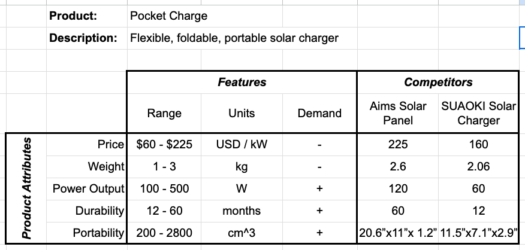



```{r}
#| include: false

agenda_items <- c(
  "Working with data frames",
  "Data wrangling with the _tidyverse_",
  "Project proposals"
)
```

---

# Required Packages (check `practice.R` file)

Make sure you have these libraries installed:

```{r}
#| eval: false
install.packages("tidyverse")
```

**Remember: you only need to install packages once!**

. . .

<br>

Once installed, you'll need to _load_ the libraries every time you open Positron:

```{r}
#| eval: false
library(tidyverse)
```

---

```{r}
#| echo: false
#| output: asis
agenda(0)
```

---

```{r}
#| echo: false
#| output: asis
agenda(1)
```

---



# The data frame...in Excel

<center>

</center>

---

# The data frame...in R

```{r}
beatles <- tibble(
    firstName   = c("John", "Paul", "Ringo", "George"),
    lastName    = c("Lennon", "McCartney", "Starr", "Harrison"),
    instrument  = c("guitar", "bass", "drums", "guitar"),
    yearOfBirth = c(1940, 1942, 1940, 1943),
    deceased    = c(TRUE, FALSE, FALSE, TRUE)
)

beatles
```

---

## **Columns**: _Vectors_ of values (must be same data type)

```{r}
beatles
```

. . .

Extract a column using `$`

```{r}
beatles$firstName
```

---

## **Rows**: Information about individual observations

Information about _John Lennon_ is in the first row:

```{r}
beatles[1,]
```

. . .

Information about _Paul McCartney_ is in the second row:

```{r}
beatles[2,]
```

---





## Take a look at the `beatles` data frame in `practice.R`

---

# Getting data into R

<br>

## 1. Load external packages
## 2. Read in external files (usually a `.csv` file)

<br>

NOTE: csv = "comma-separated values"

---

## Data from an R package

```{r}
#| eval: false
#| message: false
library(ggplot2)
```

. . .

See which data frames are available in a package:

```{r}
#| eval: false
data(package = "ggplot2")
```

. . .

Find out more about a package data set:

```{r}
#| eval: false
?msleep
```

---





## Back to `practice.R`

---

# Importing an external data file

<br>

::: {.col width="60%"}

Note the `data.csv` file in your `data` folder.

- **DO NOT** double-click it!
- **DO NOT** open it in Excel!

Excel can **corrupt** your data!

:::

::: {.col .fragment width="40%"}

If you **must** open it in Excel:

- Make a copy
- Open the copy

:::

---

# Steps to importing external data files

. . .

## 1. Create a path to the data

```{r}
#| code-line-numbers: "2"
path_to_data <- file.path('data', 'data.csv')
path_to_data
```

. . .

## 2. Import the data

```{r}
#| eval: false
#| code-line-numbers: "2"
library(tidyverse)
data <- read_csv(path_to_data)
```

---

## Using `file.path()` to make file paths

Your paths start from **the folder you opened in Positron** <br>(**File › Open Folder…** - not double-clicking a file!)

```{r}
getwd()
```

. . .

`file.path()` joins the pieces into a path to a file _inside_ that folder

```{r}
path_to_data <- file.path('data', 'data.csv')
path_to_data
```

---

# Avoid hard-coding file paths!

### (they break on every computer but yours)

```{r}
#| eval: false
path_to_data <- '/Users/jhelvy/Documents/madd/week3/data/data.csv'
```

# 💩💩💩

---

# Back to reading in data

```{r}
#| eval: false
#| code-line-numbers: "2"
path_to_data <- file.path('data', 'data.csv')
data <- read_csv(path_to_data)
```

<br>

**Important**: Use `read_csv()` instead of `read.csv()`

---



```{r}
#| echo: false
countdown(
    minutes = 10,
    warn_when = 30,
    update_every = 1,
    top = 0,
    right = 0,
    font_size = '2em'
)
```

## Your turn

::: {.font90}

1) Use the `file.path()` and `read_csv()` functions to load the `data.csv` file that is in the `data` folder. Name the data frame object `data`.

2) Use the `data` object to answer the following questions:

- How many rows and columns are in the data frame?
- What type of data is each column? (Just look, don't need to type out the answer)
- Preview the different columns - what do you think this data is about? What might one row represent?
- How many unique airports are in the data frame?
- What is the earliest and latest observation in the data frame?
- What is the lowest and highest cost of any one repair in the data frame?

:::

---

```{r}
#| echo: false
#| output: asis
agenda(2)
```

---



### The tidyverse: `stringr` + `dplyr` + `readr` +  `ggplot2` + ...

<center>

</center>Art by [Allison Horst](https://www.allisonhorst.com/)

---



# 80% of the job is data wrangling

<center>

</center>

---



## Today: data wrangling with **dplyr**

<center>

</center>Art by [Allison Horst](https://www.allisonhorst.com/)

---

# [The main `dplyr` "verbs"]{.center}

<br>

"Verb"        | What it does
--------------|--------------------
`select()`    | Select columns by name
`filter()`    | Keep rows that match criteria
`arrange()`   | Sort rows based on column(s)
`mutate()`    | Create new columns
`summarize()` | Create summary values

---

# [Core `tidyverse` concept:<br>**Chain functions together with "pipes"**]{.center}

# [`%>%`]{.center}

. . .

## Think of the words "...and then..."

```{r}
#| eval: false
data %>%
  do_something() %>%
  do_something_else()
```

---

# Think of `%>%` as the words "...and then..."

. . .

**Without Pipes** (read from inside-out):

```{r}
#| eval: false
leave_house(get_dressed(get_out_of_bed(wake_up(me))))
```

. . .

**With Pipes**:

```{r}
#| eval: false
me %>%
    wake_up %>%
    get_out_of_bed %>%
    get_dressed %>%
    leave_house
```

---





# Select columns with `select()`

<br>
<center>

</center>

---

# Select columns with `select()`

```{r}
beatles <- tibble(
    firstName   = c("John", "Paul", "Ringo", "George"),
    lastName    = c("Lennon", "McCartney", "Starr", "Harrison"),
    instrument  = c("guitar", "bass", "drums", "guitar"),
    yearOfBirth = c(1940, 1942, 1940, 1943),
    deceased    = c(TRUE, FALSE, FALSE, TRUE)
)

beatles
```

---

# Select columns with `select()`

Select the columns `firstName` & `lastName`

```{r}
beatles %>%
  select(firstName, lastName)
```

---

# Select columns with `select()`

Use the `-` sign to drop columns

```{r}
beatles %>%
  select(-firstName, -lastName)
```

---

# Select columns with `select()`

Select columns based on name criteria:

- `ends_with()` = Select columns that end with a character string
- `contains()` = Select columns that contain a character string
- `matches()` = Select columns that match a regular expression
- `one_of()` = Select column names that are from a group of names

---

# Select columns with `select()`

Select the columns that end with `"Name"`:

```{r}
beatles %>%
  select(ends_with("Name"))
```

---





# Keep specific rows with `filter()`

<br>
<center>

</center>

---

# Keep specific rows with `filter()`

Keep only the rows with band members born after 1941

```{r}
#| eval: false
#| code-line-numbers: "5,7"
#> # A tibble: 4 × 5
#>   firstName lastName  instrument yearOfBirth deceased
#>   <chr>     <chr>     <chr>            <dbl> <lgl>
#> 1 John      Lennon    guitar            1940 TRUE
#> 2 Paul      McCartney bass              1942 FALSE
#> 3 Ringo     Starr     drums             1940 FALSE
#> 4 George    Harrison  guitar            1943 TRUE
```

---

# Keep specific rows with `filter()`

Keep only the rows with band members born after 1941

```{r}
beatles %>%
  filter(yearOfBirth > 1941)
```

---

# Keep specific rows with `filter()`

Keep only the rows with band members born after 1941 **& are still living**

```{r}
beatles %>%
  filter(yearOfBirth > 1941, deceased == FALSE)
```

. . .

```{r}
beatles %>%
  filter((yearOfBirth > 1941) & (deceased == FALSE))
```

---

# [Logic operators for `filter()`]{.center}

<br>

Description | Example
------------|------------
Values greater than 1 | `value > 1`
Values greater than or equal to 1 | `value >= 1`
Values less than 1 | `value < 1`
Values less than or equal to 1 | `value <= 1`
Values equal to 1 | `value == 1`
Values not equal to 1 | `value != 1`
Values in the set c(1, 4) | `value %in% c(1, 4)`

---

# Removing missing values

Drop all rows where `variable` is `NA`

```{r}
#| eval: false
data %>%
    filter(!is.na(variable))
```

---

# Combine `filter()` and `select()`

Get the **first & last name** of members born after 1941 & are still living

```{r}
beatles %>%
  filter(yearOfBirth > 1941, deceased == FALSE) %>%
  select(firstName, lastName)
```

---



```{r}
#| echo: false
countdown(
    minutes = 10,
    warn_when = 30,
    update_every = 1,
    top = 0,
    right = 0,
    font_size = '2em'
)
```

## Your turn

::: {.font90}

1) Use the `file.path()` and `read_csv()` functions to load the `data.csv` file that is in the `data` folder. Name the data frame object `data`.

2) Use the `data` object and the `select()` and `filter()` functions to answer the following questions:

- Create a new data frame, `dc`, that contains only the rows from DC airports.
- Create a new data frame, `dc_dawn`, that contains only the rows from DC airports that occurred at dawn.
- Create a new data frame, `dc_dawn_birds`, that contains only the rows from DC airports that occurred at dawn and only the columns about the _species_ of bird.
- How many unique species of birds have been involved in accidents at DC airports?

:::

---





## Create new variables with `mutate()`

<br>
<center>

</center>

---




<center>

</center>Art by [Allison Horst](https://www.allisonhorst.com/)

---

# Create new variables with `mutate()`

Use the `yearOfBirth` variable to compute the age of each band member

```{r}
beatles %>%
    mutate(age = 2022 - yearOfBirth)
```

---

# You can _immediately_ use new variables

```{r}
#| code-line-numbers: "4"
beatles %>%
    mutate(
        age = 2022 - yearOfBirth,
        meanAge = mean(age))
```

---

# [Handling if/else conditions]{.center}

### [`ifelse(<condition>, <if TRUE>, <else>)`]{.center}

. . .

```{r}
beatles %>%
    mutate(playsGuitar = ifelse(instrument == "guitar", TRUE, FALSE))
```

---

# Sort data frame with `arrange()`

. . .

Sort `beatles` data frame by year of birth

```{r}
beatles %>%
    arrange(yearOfBirth)
```

---

# Sort data frame with `arrange()`

Use the `desc()` function to sort in descending order

```{r}
#| code-line-numbers: "2"
beatles %>%
    arrange(desc(yearOfBirth))
```

---

# Sort rows with `arrange()`

Compute the band member age, then sort based on the youngest:

```{r}
beatles %>%
    mutate(age = 2022 - yearOfBirth) %>%
    arrange(age)
```

---



```{r}
#| echo: false
countdown(
    minutes = 10,
    warn_when = 30,
    update_every = 1,
    top = 0,
    right = 0,
    font_size = '2em'
)
```

## Your turn

::: {.font90}

1) Use the `file.path()` and `read_csv()` functions to load the `data.csv` file that is in the `data` folder. Name the data frame object `data`.

2) Using the `data` object, create the following new variables:

- `height_miles`: The `height` variable converted to miles (Hint: there are 5,280 feet in a mile).
- `cost_mil`: Is `TRUE` if the repair costs was greater or equal to $1 million, `FALSE` otherwise.

3) Remove rows that have `NA` for `cost_repairs_infl_adj` and re-arrange the resulting data frame based on the highest height and most expensive cost

:::

---




# [Break]{.fancy}

```{r}
#| echo: false
countdown(
    minutes      = 5,
    warn_when    = 30,
    update_every = 1,
    left         = 0, right = 0, top = 1, bottom = 0,
    margin       = "5%",
    font_size    = "8em"
)
```

---

```{r}
#| echo: false
#| output: asis
agenda(3)
```

---




# [Project Proposal Guidelines](https://madd.seas.gwu.edu/2026-Fall/project/1-proposal.html)

---

# Proposal Items

Item | Description
---- | ------------------------------------
**Abstract** | Product / technology in just a few sentences
**Introduction** | Description, picture, background
**Market Opportunity** | Identify your customer, competitors, and market size
**Product Attributes** | 2-4 key variables related to product's design and performance
**Research Questions** | 2-4 research questions you hope to answer about your product
**Questions** | Major outstanding questions to be resolved

---

# Today

::: {.col}

### Market Opportunity

- Identify customer
- Identify competitors
- Identify market size

:::

::: {.col .fragment}

### Product Attributes

Features your _customer_ cares about

:::

::: {.col .fragment}

### Research Questions

Decisions you are trying to inform

:::

---




# [Example: **Folding solar panels**]{.center}

::: {.col width="60%"}

<center>

</center>

:::

::: {.col width="40%"}

### Who is your customer?

- General public?
- Outdoor enthusiasts?
- Emergency gear?

### Competitors?

- Similar folding panels
- Batteries?

:::

---




# [Example: **Electric vehicle battery**]{.center}

::: {.col width="60%"}

<center>

</center>

:::

::: {.col width="40%"}

### Who is your customer?

- Car buyers

### Competitors?

- Hybrid vehicles?
- Efficient gasoline vehicles?

:::

---




::: {.col}

## Product Attributes

#### Features your _customer_ cares about

:::

::: {.col}

## Research Questions

#### Decisions you are trying to inform

:::

---



---



# Product Attributes Table ([example](https://docs.google.com/spreadsheets/d/1ewHLXWS0mnHOALPwat_DH-EC3yttoBTL3nPZzRbb9YA/edit?usp=sharing))

<center>

</center>

---



```{r}
#| echo: false
countdown(
    minutes = 15,
    warn_when = 30,
    update_every = 1,
    top = 0,
    right = 0,
    font_size = '2em'
)
```

## Team Proposals

1. Sit with your team
2. Discuss & identify your customer & potential competitors
3. Discuss & identify key _Product Attributes_ & _Research Questions_
4. Start building out your model relationships table (copy from [this example](https://docs.google.com/spreadsheets/d/1ewHLXWS0mnHOALPwat_DH-EC3yttoBTL3nPZzRbb9YA/edit?usp=sharing))

### Suggestions

- You may want to start with simple bullet lists
- Start with more items rather than fewer (can always cut back later)
