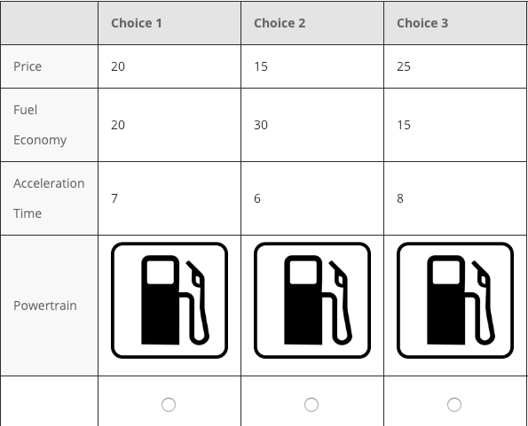
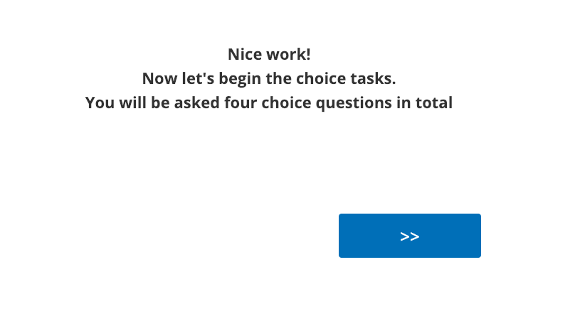
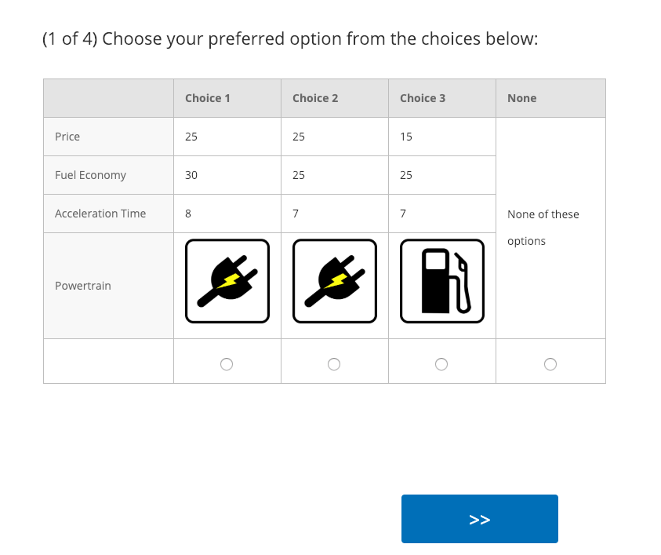
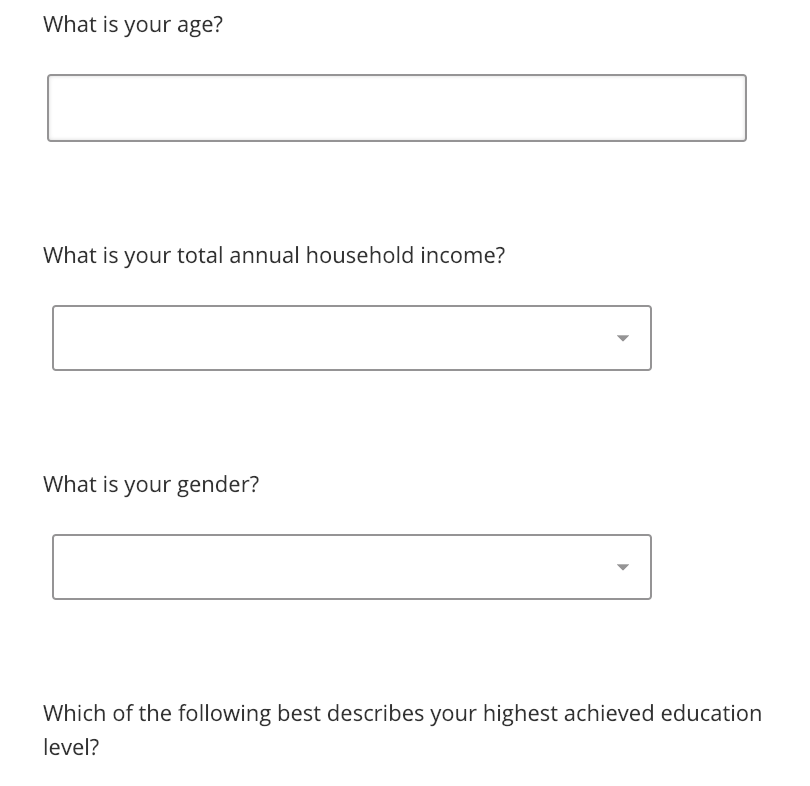
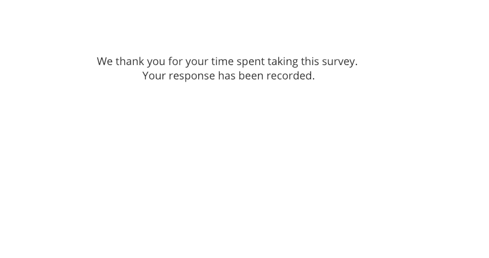

```{r setup, child="../setup.Rmd"}
```

```{r}
#| echo: false

library(surveydown)
```

---

class: inverse

# Quiz 1

```{r, echo=FALSE}
countdown(
  minutes      = 12,
  warn_when    = 30,
  update_every = 1,
  top          = 0,
  right        = 0,
  font_size    = '3em'
)
```

.leftcol[

## Write your name on the quiz!

## Rules:

- Work alone; no outside help of any kind is allowed.
- No calculators, no notes, no books, no computers, no phones.

]

.rightcol[

<br>
<center>

</center>

]

---

```{r child="topics/0.Rmd"}
```

---

```{r child="topics/1.Rmd"}
```

---

class: middle, center

# Follow along with<br>[this workshop](https://jhelvy.github.io/2025-surveydown-workshop/) on surveydown

---

```{r child="topics/2.Rmd"}
```

---

# 3 Parts

<br>

- ### **Part 1**: Intro
- ### **Part 2**: Conjoint questions
- ### **Part 3**: Other / demographic questions

---

# 3 Parts

<br>

- ### **Part 1**: Intro --> .red[screen for target population]
- ### **Part 2**: Conjoint questions --> .red[screen for random answers]
- ### **Part 3**: Other / demographic questions

---

# .center[Think of your survey as a _conversation_]

<br>

- Include "transition" pages (e.g. Great job! Now we'll ask you about...) 

---

class: middle, center, inverse

# **Part 1**: Intro

---

class: center

# Start with a welcome page

<center>

</center>

---

class: center, middle

.leftcol30[

# Consent form

]

.rightcol70[

<center>

</center>

]

---

class: center

## **Eligibility questions**: who is your target population?

### .red[_Filter out respondents here_]

<center>

</center>

---

class: middle, center, inverse

# **Part 2**: Conjoint questions

---

class: middle, center

# Education information

<center>

</center>

---

class: center

# Education information

.leftcol[

<center>

</center>

]

.rightcol[

<center>

</center>

]

---

## .center[Can be helpful to provide relative comparisons]

Weight: 

- 1/2 lbs (similar to 1 cup water)
- 8 lbs (similar to 1 gallon of milk)

---

class: center

# Conjoint intro

<center>

</center>

---

class: center

## Practice conjoint (also attention check)

### .red[_May also filter out respondents here_]

<center>

</center>

---

class: center

# Transition to actual conjoint questions

<center>

</center>

---

class: middle 

.leftcol40[

# Conjoint questions

### .red[_May also filter out respondents at the end_]

(e.g. chose all same answers)

]

.rightcol60[

<center>

</center>

]

---

class: middle, center, inverse

# **Part 3**: Other / demographic questions

---

class: center

# Transition

<center>

</center>

---

class: center

# Critical respondent information 

<center>

</center>

---

class: center
 
# Demographic / other questions
 
<center>

</center>

---

class: center

# Finale

<center>

</center>

---

class: inverse, center, middle

# [Blog post on conjoint in surveydown](https://surveydown.org/blog/2024-08-28-choice-based-conjoint-surveys-with-surveydown/)

--

# [Project survey plan](https://madd.seas.gwu.edu/2026-Fall/project/2-survey-plan.html)

--

# Sign up for meeting slot next week<br>(link in #project channel)

