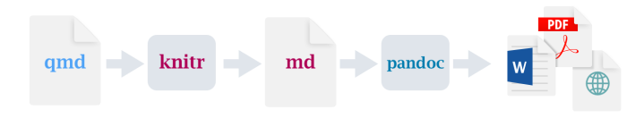
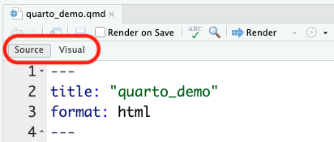
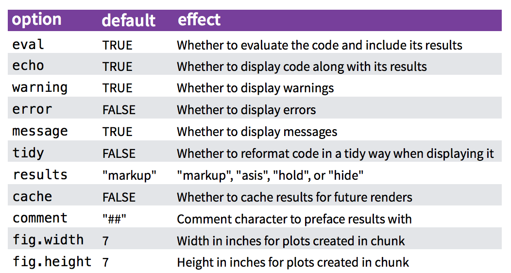
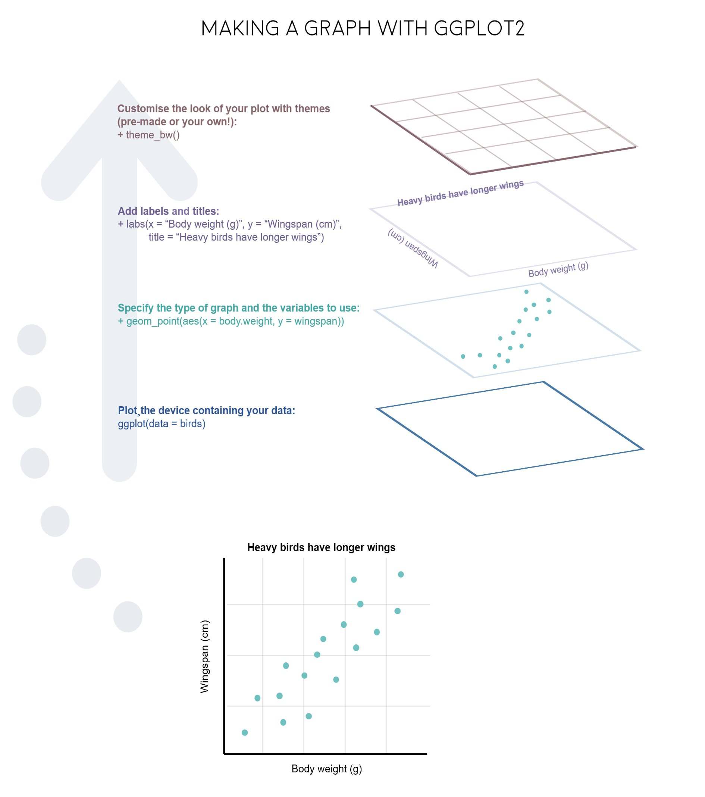
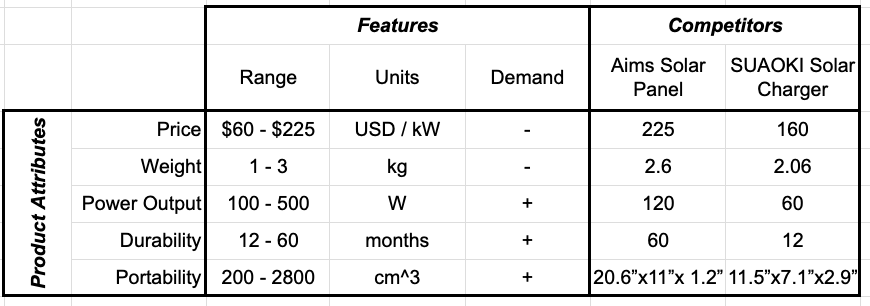



```{r}
#| include: false

# For this class
data <- mtcars
bears <- read_csv(file.path('data', 'bear_killings.csv'))
theme_set(theme_gray(base_size = 16))

agenda_items <- c(
  "Intro to Quarto",
  "Intro to ggplot2",
  "Project attributes & levels"
)
```

---

```{r}
#| echo: false
#| output: asis
agenda(0)
```

---

```{r}
#| echo: false
#| output: asis
agenda(1)
```

---



# "Literate programming"

::: {.col .left}

> ### Treat programs as a "literature" understandable to **human beings**

:::

::: {.col .center}

<center>

</center>

[Donald E. Knuth](https://en.wikipedia.org/wiki/Donald_Knuth)

:::

---




# [Quick demo]{.center}

<br>

# 1. Open `quarto_demo.qmd`

# 2. Click "Render"

<center>

</center>

---

# [Anatomy of a .qmd file]{.center}

<br>

# [Header]{.red}

# Markdown text

# R code

---

# Define overall document options in header

::: {.col}

Basic html page

```
---
title: Your title
author: Author name
format: html
---
```

:::

::: {.col}

Add table of contents, change theme

```
---
title: Your title
author: Author name
toc: true
format:
  html:
    theme: united
---
```

More on themes at https://quarto.org/docs/output-formats/html-themes.html

:::

---

# Render to multiple outputs

::: {.col}

### PDF uses LaTeX

```
---
title: Your title
author: Author name
format: pdf
---
```

If you don't have LaTeX on your computer, install tinytex in R:

```{r}
#| eval: false

tinytex::install_tinytex()
```

:::

::: {.col}

### Microsoft Word

```
---
title: Your title
author: Author name
format: docx
---
```

:::

---

# [Anatomy of a .qmd file]{.center}

<br>

# ~~Header~~

# [Markdown text]{.red}

# R code

---



# Right now, bookmark this! 👇

# https://commonmark.org/help/

<br><hr><br>

# (When you have 10 minutes, do this! 👇)

# https://commonmark.org/help/tutorial/

---

# [Headers]{.center}

. . .

::: {.col}

```markdown
# HEADER 1

## HEADER 2

### HEADER 3

#### HEADER 4

##### HEADER 5

###### HEADER 6
```

:::

::: {.col .fragment}

# HEADER 1

## HEADER 2

### HEADER 3

#### HEADER 4

##### HEADER 5

###### HEADER 6

:::

---

# [Basic Text Formatting]{.center}

::: {.col}

## Type this...

- `normal text`
- `_italic text_`
- `*italic text*`
- `**bold text**`
- `***bold italic text***`
- `~~strikethrough~~`
- `` `code text` ``

:::

::: {.col}

## ..to get this

- normal text
- _italic text_
- *italic text*
- **bold text**
- ***bold italic text***
- ~~strikethrough~~
- `code text`

:::

---

# [Lists]{.center}

::: {.col}

Bullet list:

```{r}
#| eval: false
- first item
- second item
- third item
```

- first item
- second item
- third item

:::

::: {.col}

Numbered list:

```{r}
#| eval: false
1. first item
2. second item
3. third item
```

1. first item
2. second item
3. third item

:::

---

# [Links]{.center}

Simple **url link** to another site:

```{r}
#| eval: false
[Download R](http://www.r-project.org/)
```

[Download R](http://www.r-project.org/)

---




# Don't want to use Markdown?

# [Use Visual Mode!]{.red}

<center>

</center>

---

# [Anatomy of a .qmd file]{.center}

<br>

# ~~Header (think of this as the "settings")~~

# ~~Markdown text~~

# [R code]{.red}

---



# R Code

. . .

::: {.col}

## Inline code

```{r}
#| eval: false
`r insert code here`
```

:::

::: {.col .fragment}

## Code chunks

````markdown
`r ''````{r}
insert code here
insert more code here
```
````

:::

---

# Inline R code

```{r}
#| eval: false
The sum of 3 and 4 is `r 3 + 4`
```

. . .

Produces this:

The sum of 3 and 4 is `r 3 + 4`

---

# R Code chunks

::: {.col}

This code chunk...

````markdown
`r ''````{r}
library(palmerpenguins)

head(penguins)
```
````

:::

::: {.col .fragment}

...will produce this when compiled:

```{r}
library(palmerpenguins)

head(penguins)
```

:::

---

# Chunk options

Control what chunks output using options

All options [here](https://quarto.org/docs/reference/cells/cells-knitr.html)

```{r}
#| echo: false
#| out-width: '60%'

```

---

# [Chunk output options]{.center}

[By default, code chunks print **code** + **output**]{.center}

. . .

::: {.col}

````markdown
`r ''````{r}
#| echo: false

cat('hello world!')
```
````

Prints only **output**<br>(doesn't show code)

```{r}
#| echo: false

cat('hello world!')
```

:::

::: {.col .fragment}

````markdown
`r ''````{r}
#| eval: false

cat('hello world!')
```
````

Prints only **code**<br>(doesn't run the code)

```{r}
#| eval: false

cat('hello world!')
```

:::

::: {.col .fragment}

````markdown
`r ''````{r}
#| include: false

cat('hello world!')
```
````

Runs, but doesn't print anything

```{r}
#| include: false

cat('hello world!')
```

:::

---

# message / warning


---

# message / warning

Drop messages and warnings in chunk settings

::: {.col}

````markdown
`r ''````{r}
#| message: false
#| warning: false

library(tidyverse)
```
````

:::

---

# A global `setup` chunk 🌍

::: {.col}

````markdown
`r ''````{r}
#| label: setup
#| include: false

knitr::opts_chunk$set(
    warning = FALSE,
    message = FALSE,
    fig.path = "figs/",
    fig.width = 7.252,
    fig.height = 4,
    comment = "#>",
    fig.retina = 3
)
```
````

:::

::: {.col}

- Typically the first chunk
- All following chunks will use these options (i.e., sets global chunk options)
- You can (and should) use individual chunk options too
- Often where I load libraries, etc.

:::

---



```{r}
#| echo: false
countdown(
    minutes = 15,
    warn_when = 15,
    update_every = 1,
    top = 0,
    right = 0,
    font_size = '2em'
)
```

# Your turn

::: {.font90}

1) Open the `bears.qmd` file, and title it _"Bears Analysis"_

2) Create a "setup" code chunk to read in the `bear_killings.csv` data file<br>(HINT: You might want to look back at the `quarto_demo.qmd` file!).

3) Use text and code to find answers each of the following questions - show your code and results to justify each answer:

- Which months have the highest frequency of bear killings?
- Who has been killed more often by bears: hunters or hikers?
- How do the the number of bear attacks on men vs women compare?

HINT: Use `bears %>% count(variable)` to count how many rows are in the data for each unique value of `variable`

:::

---

```{r}
#| echo: false
#| output: asis
agenda(2)
```

---

::: {.col}



:::

::: {.col}

# "Grammar of Graphics"

Concept developed by Leland Wilkinson (1999)

**ggplot2** package developed by Hadley Wickham (2005)

:::

---

# Making plot layers with ggplot2

<br>

### 1. The data
### 2. The aesthetic mapping (what goes on the axes?)
### 3. The geometries (points? bars? etc.)
### 4. The annotations / labels
### 5. The theme

---

# Layer 1: The data

```{r}
head(mpg)
```

---

# Layer 1: The data

The `ggplot()` function initializes the plot with whatever data you're using

::: {.col}

```{r}
#| label: ggblank
#| fig-show: hide
mpg %>%
  ggplot()
```

:::

::: {.col .border}

```{r}
#| ref-label: ggblank
#| echo: false
#| fig-height: 5
#| fig-width: 7
```

:::

---

# Layer 2: The aesthetic mapping

The `aes()` function determines which variables will be _mapped_ to the geometries<br>(e.g. the axes)

::: {.col}

```{r}
#| label: ggaes
#| fig-show: hide
#| code-line-numbers: "2"
mpg %>%
  ggplot(aes(x = displ, y = hwy))
```

:::

::: {.col .border}

```{r}
#| ref-label: ggaes
#| echo: false
#| fig-height: 5
#| fig-width: 7
```

:::

---

# Layer 3: The geometries

Use `+` to add geometries, e.g. `geom_points()` for points

::: {.col}

```{r}
#| label: ggpoint
#| fig-show: hide
#| code-line-numbers: "3"
mpg %>%
  ggplot(aes(x = displ, y = hwy)) +
  geom_point()
```

:::

::: {.col .border}

```{r}
#| ref-label: ggpoint
#| echo: false
#| fig-height: 5
#| fig-width: 7
```

:::

---

# Layer 4: The annotations / labels

Use `labs()` to modify most labels

::: {.col}

```{r}
#| label: gglabs
#| fig-show: hide
#| code-line-numbers: "4,5,6,7,8"
mpg %>%
  ggplot(aes(x = displ, y = hwy)) +
  geom_point() +
  labs(
    x = "Engine displacement (liters)",
    y = "Highway fuel economy (mpg)",
    title = "Most larger engine vehicles are less fuel efficient"
  )
```

:::

::: {.col}

```{r}
#| ref-label: gglabs
#| echo: false
#| fig-height: 5
#| fig-width: 7
```

:::

---

# Layer 5: The theme

::: {.col}

```{r}
#| label: ggtheme_bw
#| fig-show: hide
#| code-line-numbers: "9"
mpg %>%
  ggplot(aes(x = displ, y = hwy)) +
  geom_point() +
  labs(
    x = "Engine displacement (liters)",
    y = "Highway fuel economy (mpg)",
    title = "Most larger engine vehicles are less fuel efficient"
  ) +
  theme_bw()
```

:::

::: {.col}

```{r}
#| ref-label: ggtheme_bw
#| echo: false
#| fig-height: 5
#| fig-width: 7
```

:::

---

### Common themes

::: {.col}

`theme_bw()`

```{r}
#| fig-height: 4
#| fig-width: 6
#| code-line-numbers: "4"
mpg %>%
  ggplot(aes(x = displ, y = hwy)) +
  geom_point() +
  theme_bw()
```

:::

::: {.col}

`theme_minimal()`

```{r}
#| fig-height: 4
#| fig-width: 6
#| code-line-numbers: "4"
mpg %>%
  ggplot(aes(x = displ, y = hwy)) +
  geom_point() +
  theme_minimal()
```

:::

---

### Common themes

::: {.col}

`theme_classic()`

```{r}
#| fig-height: 4
#| fig-width: 6
#| code-line-numbers: "4"
mpg %>%
  ggplot(aes(x = displ, y = hwy)) +
  geom_point() +
  theme_classic()
```

:::

::: {.col}

`theme_void()`

```{r}
#| fig-height: 4
#| fig-width: 6
#| code-line-numbers: "4"
mpg %>%
  ggplot(aes(x = displ, y = hwy)) +
  geom_point() +
  theme_void()
```

:::

---

### Other themes: [hrbrthemes](https://github.com/hrbrmstr/hrbrthemes)

```{r}
#| eval: false
remotes::install_github("hrbrmstr/hrbrthemes")
```

::: {.col}

```{r}
#| fig-height: 4
#| fig-width: 6
#| code-line-numbers: "4"
mpg %>%
  ggplot(aes(x = displ, y = hwy)) +
  geom_point() +
  hrbrthemes::theme_ipsum()
```

:::

::: {.col}

```{r}
#| fig-height: 4
#| fig-width: 6
#| code-line-numbers: "4"
mpg %>%
  ggplot(aes(x = displ, y = hwy)) +
  geom_point() +
  hrbrthemes::theme_ft_rc()
```

:::

---

### Other themes: [ggthemes](https://jrnold.github.io/ggthemes/)

```{r}
#| eval: false
install.packages('ggthemes', dependencies = TRUE)
```

::: {.col}

```{r}
#| fig-height: 4
#| fig-width: 6
#| code-line-numbers: "4"
mpg %>%
  ggplot(aes(x = displ, y = hwy)) +
  geom_point() +
  ggthemes::theme_economist()
```

:::

::: {.col}

```{r}
#| fig-height: 4
#| fig-width: 6
#| code-line-numbers: "4"
mpg %>%
  ggplot(aes(x = displ, y = hwy)) +
  geom_point() +
  ggthemes::theme_economist_white()
```

:::

---





# More practice

# Open `ggplot2.qmd`

---




::: {.col}

```{r}
#| echo: false

mpg %>%
  ggplot() +
  geom_smooth(aes(x = displ, y = hwy, color = drv))
```

```{r}
#| echo: false

mpg %>%
  count(class, drv) %>%
  ggplot() +
  geom_col(aes(x = drv, y = n, fill = class), width = 0.7)
```

:::

::: {.col}

```{r}
#| echo: false
countdown(
    minutes = 15,
    warn_when = 15,
    update_every = 1,
    top = 0,
    right = 0,
    font_size = '2em'
)
```

## Your turn

Open `practice.qmd`

Use the `mpg` data frame and ggplot to create these charts

```{r}
#| echo: false

mpg %>%
  ggplot(aes(x = displ, y = hwy)) +
  geom_point(aes(color = class)) +
  geom_smooth(se = FALSE)
```

:::

---



# Extra practice

::: {.col}

```{r}
#| label: ggbar_p1
#| echo: false
#| fig-height: 5
#| fig-width: 7
bears %>%
  count(year, gender) %>%
  ggplot() +
  geom_col(aes(x = year, y = n, fill = gender)) +
  labs(
    x     = "Year",
    y     = 'Number of killings',
    fill  = "Victim gender",
    title = "Annual deadly bear attacks over time"
  ) +
  theme_bw()
```

:::

::: {.col}

```{r}
#| fig-height: 4
#| fig-width: 6
#| echo: false
mpg %>%
    mutate(manufacturer = str_to_title(manufacturer)) %>%
    group_by(manufacturer) %>%
    summarise(mean_hwy = mean(hwy)) %>%
    ggplot() +
    geom_col(
      aes(x = mean_hwy, y = reorder(manufacturer, mean_hwy)),
      width = 0.9) +
    labs(
      x = 'Highway fuel economy (mpg)',
      y = 'Vehicle manufacturer',
      title = 'Mean fuel economy by automaker'
    ) +
    theme_minimal()
```

:::

---

```{r}
#| echo: false
#| output: asis
agenda(3)
```

---



# Model Relationships Table ([example](https://docs.google.com/spreadsheets/d/1Hmxfav_l1bubnaPkIiiMW0tZrFA-xblP9_ndN_6TB1I/edit?usp=sharing))

::: {.border}

<center>

</center>

:::

## Start defining attribute _levels_

---

# Defining attribute levels

::: {.col}

## Continuous

- **Price**: 1, 2, 3, 4, 5 ($)
- **Power Output**: 60, 80, 120 (Watts)

## Discrete

- **Color**: Red, Blue, Yellow
- **Material**: Plastic, Aluminum, Glass

:::

::: {.col}

- Look at competitors
- Search web for values that cover the full set of values available today (and maybe some into the future)

:::

---

# Reminders:

- You have **11** days until your [Project Proposal](https://madd.seas.gwu.edu/2026-Fall/project/1-proposal.html) is due.
- Next week: **Project Proposal Meetings** - sign up **[HERE](https://calendar.app.google/niXopBudj9t4pmbj7)**
