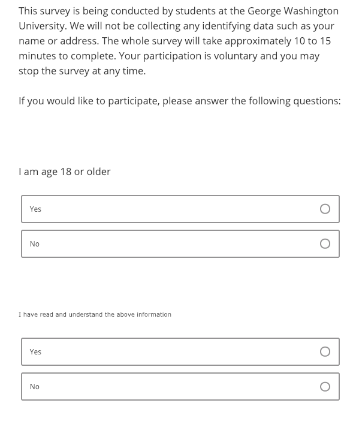
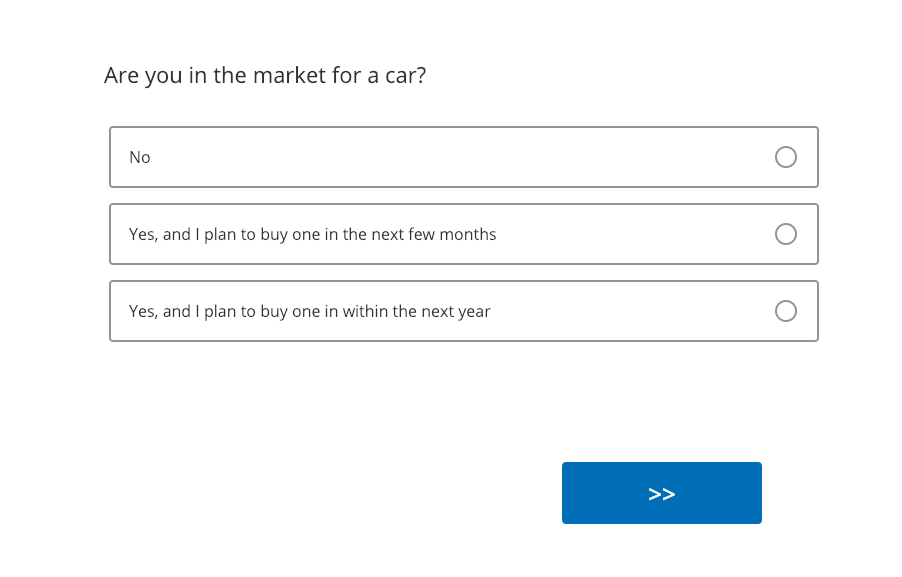



```{r}
#| include: false

library(surveydown)

agenda_items <- c(
  "surveydown basics",
  "Conjoint survey components"
)
```

---



# Quiz 1

```{r}
#| echo: false
countdown(
  minutes      = 12,
  warn_when    = 30,
  update_every = 1,
  top          = 0,
  right        = 0,
  font_size    = '3em'
)
```

::: {.col}

## Write your name on the quiz!

## Rules:

- Work alone; no outside help of any kind is allowed.
- No calculators, no notes, no books, no computers, no phones.

:::

::: {.col}

<br>
<center>

</center>

:::

---

```{r}
#| echo: false
#| output: asis
agenda(0)
```

---

```{r}
#| echo: false
#| output: asis
agenda(1)
```

---




# Follow along with<br>[this workshop](https://jhelvy.github.io/2025-surveydown-workshop/) on surveydown

---

```{r}
#| echo: false
#| output: asis
agenda(2)
```

---

# 3 Parts

<br>

::: {.font150}
- **Part 1**: Intro
- **Part 2**: Conjoint questions
- **Part 3**: Other / demographic questions
:::

---

# 3 Parts

<br>

::: {.font150}
- **Part 1**: Intro → [screen for target population]{.red}
- **Part 2**: Conjoint questions → [screen for random answers]{.red}
- **Part 3**: Other / demographic questions
:::

---

# [Think of your survey as a _conversation_]{.center}

<br>

- Include "transition" pages (e.g. Great job! Now we'll ask you about...)

---





# **Part 1**: Intro

---



# Start with a welcome page

<center>

</center>

---




::: {.col width="30%"}

# Consent form

:::

::: {.col width="70%"}

<center>

</center>

:::

---



## **Eligibility questions**: who is your target population?

### [_Filter out respondents here_]{.red}

<center>

</center>

---





# **Part 2**: Conjoint questions

---




# Education information

<center>

</center>

---



# Education information

::: {.col}

<center>

</center>

:::

::: {.col}

<center>

</center>

:::

---

## [Can be helpful to provide relative comparisons]{.center}

Weight:

- 1/2 lbs (similar to 1 cup water)
- 8 lbs (similar to 1 gallon of milk)

---



# Conjoint intro

<center>

</center>

---



## Practice conjoint (also attention check)

### [_May also filter out respondents here_]{.red}

<center>

</center>

---



# Transition to actual conjoint questions

<center>

</center>

---



::: {.col width="40%"}

# Conjoint questions

### [_May also filter out respondents at the end_]{.red}

(e.g. chose all same answers)

:::

::: {.col width="60%"}

<center>

</center>

:::

---





# **Part 3**: Other / demographic questions

---



# Transition

<center>

</center>

---



# Critical respondent information

<center>

</center>

---



# Demographic / other questions

<center>

</center>

---



# Finale

<center>

</center>

---





# [Blog post on conjoint in surveydown](https://surveydown.org/blog/2024-08-28-choice-based-conjoint-surveys-with-surveydown/)

::: {.fragment}
# [Project survey plan](https://madd.seas.gwu.edu/2026-Fall/project/2-survey-plan.html)
:::

::: {.fragment}
# Sign up for meeting slot next week<br>(link in #project channel)
:::
