

```{r}
#| include: false

library(surveydown)

agenda_items <- c(
  "What is surveydown?",
  "Survey basics",
  "Conditional logic",
  "Storing & fetching data",
  "Reactivity"
)
```

---

```{r}
#| echo: false
#| output: asis
agenda(0)
```

---

# Before we start...

<br>

## 1. Install surveydown

```{r}
#| eval: false
install.packages("surveydown")
```

<br>

## 2. Download today's class files

Each `demo-*` folder is a complete survey.<br>Open one in Positron with **File › Open Folder…**

---

```{r}
#| echo: false
#| output: asis
agenda(1)
```

---




# Typical experience making a survey

<center>
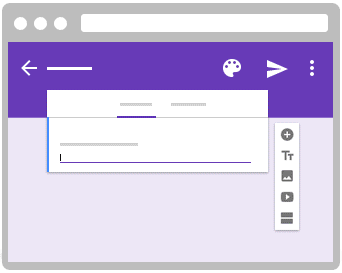
</center>

---




::: {.col width="60%"}

<center>

</center>

:::

::: {.col width="40%"}

### ❌ Reproducible
### ❌ Data Control
### ⚠️ Free to Use
### ⚠️ Open Source
### ⚠️ Easy Collaboration
### ⚠️ Feature Packed

:::

---



## Introducing [surveydown](https://surveydown.org/)

<center>
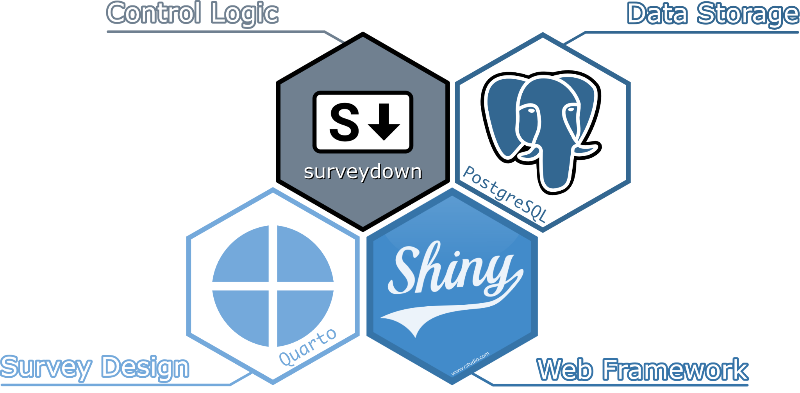
</center>

---



# Components

<br>

::: {.col}

### `survey.qmd`

A **Quarto doc** defining the main survey content (pages, text, images, questions, etc).

:::

::: {.col}

### `app.R`

An **R script** defining the survey Shiny app. It sets up the database and server, and launches the survey.

:::

---

::: {.col .font60}

````{.markdown}
---
survey-settings:
  mode: preview
---

`r ''````{r}
library(surveydown)
```

--- welcome

# Welcome to our survey!

`r ''````{r}
sd_question(
  type  = "mc",
  id    = "penguins",
  label = "What's your favorite penguin?",
  option = c(
    "Adélie"    = "adelie",
    "Chinstrap" = "chinstrap",
    "Gentoo"    = "gentoo"
  )
)
```

--- end

This is the last page of the survey.

`r ''````{r}
sd_close()
```
````

:::

::: {.col}

# [survey.qmd]{.center}

:::

---

::: {.col .font60}

````{.markdown code-line-numbers="1-8"}
---
survey-settings:
  mode: preview
---

`r ''````{r}
library(surveydown)
```

--- welcome

# Welcome to our survey!

`r ''````{r}
sd_question(
  type  = "mc",
  id    = "penguins",
  label = "What's your favorite penguin?",
  option = c(
    "Adélie"    = "adelie",
    "Chinstrap" = "chinstrap",
    "Gentoo"    = "gentoo"
  )
)
```

--- end

This is the last page of the survey.

`r ''````{r}
sd_close()
```
````

:::

::: {.col}

YAML header (survey settings)

`mode: preview` saves responses to a local file while you build

<br>
Load `surveydown` package

:::

---

::: {.col .font60}

````{.markdown code-line-numbers="10,27"}
---
survey-settings:
  mode: preview
---

`r ''````{r}
library(surveydown)
```

--- welcome

# Welcome to our survey!

`r ''````{r}
sd_question(
  type  = "mc",
  id    = "penguins",
  label = "What's your favorite penguin?",
  option = c(
    "Adélie"    = "adelie",
    "Chinstrap" = "chinstrap",
    "Gentoo"    = "gentoo"
  )
)
```

--- end

This is the last page of the survey.

`r ''````{r}
sd_close()
```
````

:::

::: {.col}

Start each page with<br>`---` and a page id:

```markdown
--- page_id

Page content
```

<br>
No closing tag needed:<br>the next `---` starts the next page

:::

---

::: {.col .font60}

````{.markdown code-line-numbers="12-25"}
---
survey-settings:
  mode: preview
---

`r ''````{r}
library(surveydown)
```

--- welcome

# Welcome to our survey!

`r ''````{r}
sd_question(
  type  = "mc",
  id    = "penguins",
  label = "What's your favorite penguin?",
  option = c(
    "Adélie"    = "adelie",
    "Chinstrap" = "chinstrap",
    "Gentoo"    = "gentoo"
  )
)
```

--- end

This is the last page of the survey.

`r ''````{r}
sd_close()
```
````

:::

::: {.col}

<br><br><br><br><br>
Use markdown for page content

Use `sd_question()` in a code chunk for survey questions

<br>
A **Next** button is added to every page automatically

:::

---

::: {.col .font60}

````{.markdown code-line-numbers="31-33"}
---
survey-settings:
  mode: preview
---

`r ''````{r}
library(surveydown)
```

--- welcome

# Welcome to our survey!

`r ''````{r}
sd_question(
  type  = "mc",
  id    = "penguins",
  label = "What's your favorite penguin?",
  option = c(
    "Adélie"    = "adelie",
    "Chinstrap" = "chinstrap",
    "Gentoo"    = "gentoo"
  )
)
```

--- end

This is the last page of the survey.

`r ''````{r}
sd_close()
```
````

:::

::: {.col}

<br><br><br><br><br><br><br><br><br><br><br><br><br>
Use `sd_close()` on the last page for an "Exit Survey" button

:::

---

::: {.col .font70}

```{r}
#| eval: false

library(surveydown)

# Connects to database
db <- sd_db_connect()

# Main UI
ui <- sd_ui()

server <- function(input, output, session) {
  # Main server
  sd_server(db)
}

shiny::shinyApp(
  ui = ui,
  server = server
)
```

:::

::: {.col}

# [app.R]{.center}

:::

---

::: {.col .font70}

```{r}
#| eval: false
#| code-line-numbers: "1,4,7,12"

library(surveydown)

# Connects to database
db <- sd_db_connect()

# Main UI
ui <- sd_ui()

server <- function(input, output, session) {
  # Main server
  sd_server(db)
}

shiny::shinyApp(
  ui = ui,
  server = server
)
```

:::

::: {.col}

Load package

Connect to database

Make standard UI

<br>Run surveydown server

:::

---



```{r}
#| echo: false
countdown(
  minutes = 5,
  top = 0,
  right = 0,
  font_size = '2em'
)
```

# Your turn

**Step 1:** Open the `demo-question-types` folder in Positron<br>(**File › Open Folder…**)

**Step 2:** Open `app.R` and click "Run App", or in the R console run:

```{r}
#| eval: false
shiny::runApp('app.R')
```

**Step 3:** Click through the survey, then look at `survey.qmd` to see how each question was made

---

# Start a new survey from a [template](https://surveydown.org/templates)

In the R console, run:

```{r}
#| eval: false
surveydown::sd_create_survey()
```

*Optional*: Specify a `path` and / or a `template`:

```{r}
#| eval: false
surveydown::sd_create_survey(
  template = "question_types",
  path = "path/to/folder"
)
```

::: {.callout-note}
Every surveydown survey should be in its own separate project folder.
:::

---

```{r}
#| echo: false
#| output: asis
agenda(2)
```

---

# YAML header

All survey settings go in the YAML header at the top of `survey.qmd`

```yaml
---
theme-settings:
  theme: default
  barposition: top
survey-settings:
  mode: preview
  show-previous: no
  all-required: no
  required: []
---
```

No header at all? Everything uses the defaults.<br>
Full list of settings on the [Survey Settings](https://surveydown.org/docs/survey-settings) docs page

---

# Survey `mode`

Set under `survey-settings` in the YAML header:

```yaml
survey-settings:
  mode: preview
```

| `mode` | Where responses are saved |
|--------|---------------------------|
| `preview` | `preview_data.csv` in your survey folder |
| `local` | `local_data.csv` in your survey folder |
| `database` (default) | Your database (see part 4) |

**Use `preview` while you build**, switch to `database` before you launch

---

# Change the survey theme

Pick a different [bootswatch theme](https://bootswatch.com) with the `theme` key:

```yaml
theme-settings:
  theme: united
```

Make a custom theme with a `custom.scss` file:

```yaml
theme-settings:
  theme: [united, custom.scss]
```

---

# Progress bar

Modify the survey progress bar with the `barcolor` and `barposition` keys:

::: {.col}

Change to any color with `barcolor`:

```yaml
theme-settings:
  barcolor: "#768692"
```

:::

::: {.col}

Change position: `top`, `bottom`, or `none`

```yaml
theme-settings:
  barposition: bottom
```

:::

---

# Inserting pages

Start each page with `---` and a page id:

```markdown
--- page_id

Page content here
```

. . .

**Next** buttons are added automatically. Add a **Previous** button to every page in the YAML:

```yaml
survey-settings:
  show-previous: yes
```

. . .

Or control one page's buttons with `sd_nav()` (e.g. change the label):

````markdown
`r ''````{r}
sd_nav(label_next = "Continue")
```
````

---

# Inserting questions

Insert questions using the `sd_question()` function, like this:

::: {.col}

**Code**

```{r}
#| eval: false
sd_question(
  type = 'mc',
  id = 'fruit',
  label = "1. Do you like fruit?",
  option = c(
    'Yes!' = 'yes',
    'Kind of' = 'kind_of',
    'No :(' = 'no'
  )
)
```

Format is `"Label" = "value"`

:::

::: {.col}

**Output**

```{r}
#| echo: false
sd_question(
  type = 'mc',
  id = 'fruit',
  label = "1. Do you like fruit?",
  option = c(
    'Yes!' = 'yes',
    'Kind of' = 'kind_of',
    'No :(' = 'no'
  )
)
```

:::

---

## surveydown supports lots of [question types](https://surveydown.org/docs/question-types)

Some common types you may want to use:

Type | Description
-----|---------------------
`mc` | Multiple choice question (single choice)
`mc_multiple` | Multiple choice question (multiple choices)
`mc_buttons` | Multiple choice question (large buttons)
`select` | Drop down menu (choose one)
`text` | Open text, single row
`textarea` | Open text, block
`numeric` | Numbers only
`matrix` | Several questions with the same options (e.g. agree / disagree)

---

# Or define questions in a `questions.yml` file

::: {.col}

In `questions.yml`:

```yaml
fruit:
  type: mc
  label: 1. Do you like fruit?
  options:
    Yes!: yes
    Kind of: kind_of
    No :(: no
```

:::

::: {.col}

In `survey.qmd`:

````markdown
`r ''````{r}
sd_question("fruit")
```
````

<br>
See the `demo-questions-yml` folder

:::

---

# Embed images with html

I recommend just writing html code, like this

```html
<center>

</center>
```

<center>

</center>

---

# Embed images with markdown

```markdown
{fig-align="center" width="250"}
```

<center>

</center>

---




# Try out the surveydown [studio app](https://github.com/surveydown-dev/sdstudio)

## `sdstudio::launch()`

---



```{r}
#| echo: false
countdown(
  minutes = 10,
  top = 0,
  right = 0,
  font_size = '2em'
)
```

## Your turn

- Make a new survey with `surveydown::sd_create_survey()` and open its folder in Positron.
- Pick a topic for your survey (a food, an animal, a sports team...whatever).
- Draft a survey about that topic in `survey.qmd`. Include the following:
    - Page 1: A welcome message in large font ("Welcome to a survey about [topic]") and an image about the topic (find an image somewhere).
    - Pages 2 to N: Add different questions about the topic using several different question types.
- Try out different themes to change the look and feel.

---

```{r}
#| echo: false
#| output: asis
agenda(3)
```

---

# Three [conditional logic](https://surveydown.org/docs/conditional-logic) functions

<br>

All go in the `server()` function in `app.R`:

<br>

| Function | What it does |
|----------|--------------|
| `sd_show_if()` | **Show** a question or page if a condition is `TRUE` |
| `sd_skip_if()` | **Skip** forward to a page if a condition is `TRUE` |
| `sd_stop_if()` | **Stop** navigation (with a message) if a condition is `TRUE` |

---




# Conditional Showing

---



## [Conditional question showing](https://surveydown.org/docs/conditional-logic#showing-questions)

<center>
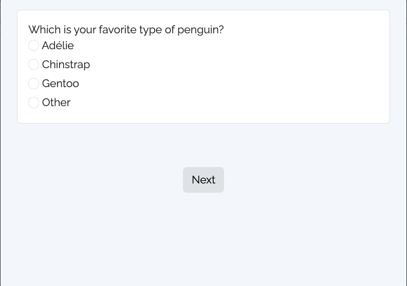
</center>

---

## Conditional question showing

Define both _conditional_ and _target_ questions in `survey.qmd`

::: {.col width="70%" .font70}

```{r}
#| eval: false

# Conditional question
sd_question(
  type = "mc",
  id = "penguins",
  label = "Which is your favorite type of penguin?",
  option = c(
    "Adélie" = "adelie",
    "Chinstrap" = "chinstrap",
    "Gentoo" = "gentoo",
    "Other" = "other"
  )
)

# Target question
sd_question(
  type = "text",
  id = "penguins_other",
  label = "Please specify the other penguin type:"
)
```

:::

---

## Conditional question showing

Define condition with `sd_show_if()` in `app.R`

```{r}
#| eval: false
#| code-line-numbers: "3,4,5"

server <- function(input, output, session) {
  sd_show_if(
    sd_value("penguins") == "other" ~ "penguins_other"
  )

  # ...other server code...
}
```

. . .

1) The structure of the condition is always:

```{r}
#| eval: false
<condition> ~ "target_question_id"
```

. . .

2) Use `sd_value("id")` to get the value of a question

---




# Conditional Page Showing

---




## Example: Randomly show one of two page versions

<br>

<center>
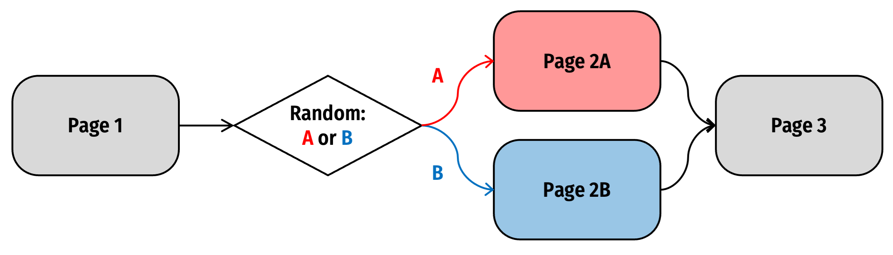
</center>

---

First, define all pages in your `survey.qmd` file:

::: {.col}

```markdown
--- page1

This is page 1

--- page2a

This is page 2A

--- page2b

This is page 2B
```

:::

::: {.col}

````markdown
--- page3

This is page 3

`r ''````{r}
sd_close()
```
````

:::

---

::: {.col}

In `app.R`:

```{r}
#| eval: false

server <- function(input, output, session) {
  # Generate random condition
  rand_val <- sample(c('A', 'B'), 1)

  # Store the condition value
  sd_store_value(rand_val)

  # Use sd_show_if to show target pages
  sd_show_if(
    rand_val == 'A' ~ 'page2a',
    rand_val == 'B' ~ 'page2b'
  )

  sd_server()
}
```

:::

::: {.col}

<br><br>
`sd_store_value()` saves `rand_val` in your response data, so you know which version each respondent saw

:::

---




# Conditional Skipping

---




# Example: **Participant screen out**

---



### Example: **Participant screen out**

<br>

<center>
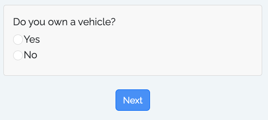
</center>

---

::: {.col width="60%"}

In `survey.qmd`: Target screenout question

```{r}
#| eval: false

sd_question(
  type = 'mc',
  id = 'vehicle_ownership',
  label = "Do you own a vehicle?",
  option = c(
    'Yes' = 'yes',
    'No' = 'no'
  )
)
```

In `app.R`:

```{r}
#| eval: false
#| code-line-numbers: "3,4,5"

server <- function(input, output, session) {
  sd_skip_if(
    sd_value("vehicle_ownership") == "no" ~ "screenout"
  )

  # ...other server code...
}
```

:::

::: {.col width="40%"}

Target screenout page

```markdown
--- screenout

Sorry, but you are not qualified to take our survey.
```

:::

---




## For all three functions, there are lots of<br>[conditions to choose from](https://surveydown.org/docs/conditional-logic#common-conditions)

See the `demo-conditional-showing` and<br>`demo-conditional-skipping` folders

---



```{r}
#| echo: false
countdown(
  minutes = 15,
  top = 0,
  right = 0,
  font_size = '2em'
)
```

## Your turn

- Open the survey you were editing from your last practice.
- Add conditional logic content:
    - Add one simple multiple choice question about your survey topic and another that will only show depending on a specific choice in the first question.
    - Add a target page that respondents should be sent to based on their choices in another question in an earlier page (e.g., a multiple choice question).

---

```{r}
#| echo: false
#| output: asis
agenda(4)
```

---



::: {.col}

## Data is stored in any PostgreSQL database

<center>

</center>

:::

::: {.col}

## We use [Supabase](https://supabase.com/) as a free, open-source option

<center>

</center>

:::

---

## Store data in [Supabase](https://supabase.com/)

Steps to connect a database via Supabase:

1. Create a Supabase account
2. Create a Supabase project
3. Copy your credentials

<br>

## Full details on the [Storing Data docs page](https://surveydown.org/docs/storing-data)

---

## Creating a project

::: {.col width="60%"}

<center>
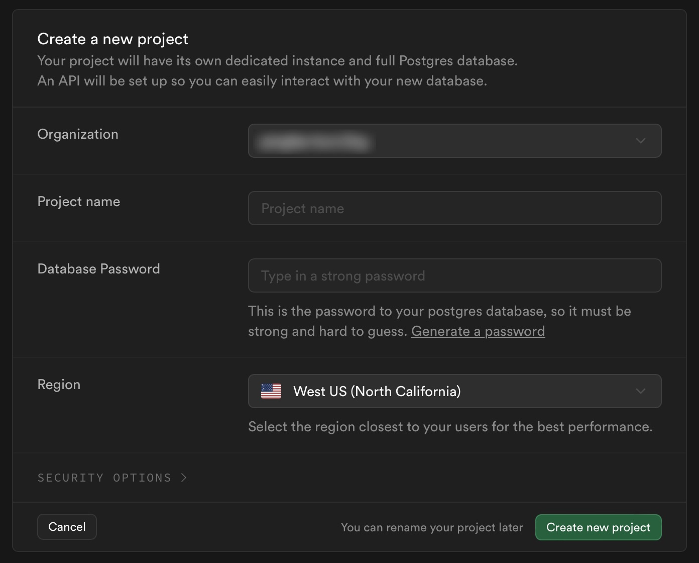
</center>

:::

::: {.col width="40%"}

- Choose a project name (this is your "database")
- Each database can have multiple tables
- Choose a strong password

:::

---

## Getting your Supabase credentials

::: {.col}

Click the "connect" button in your project

<center>
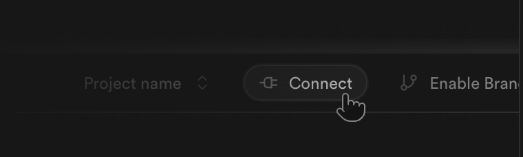
</center>

:::

::: {.col}

Choose "Direct", then find the "Transaction pooler" section

<center>
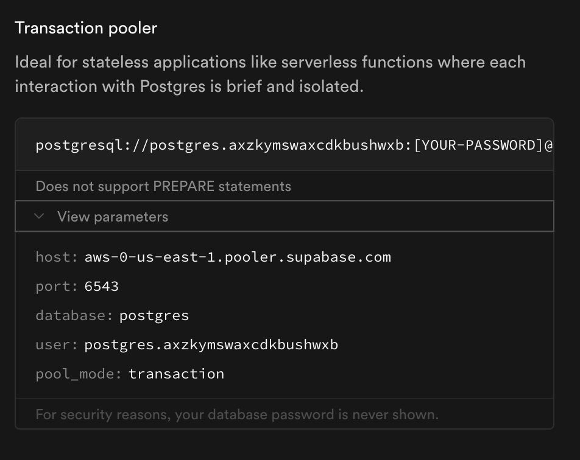
</center>

:::

---

## Store your database credentials

::: {.col}

In your R console, run:

```{r}
#| eval: false
surveydown::sd_db_config()
```

<br>

Credentials are stored in a `.env` file in your survey folder.

**Never share or commit this file** — it has your password.

:::

::: {.col}

<center>
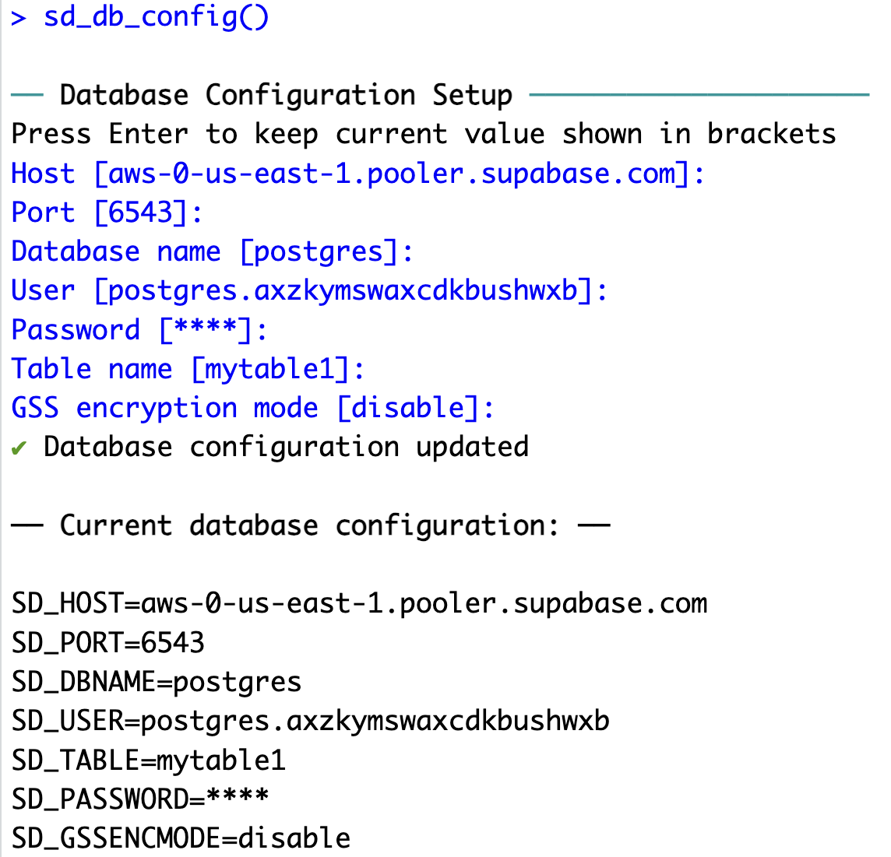
</center>

:::

---

::: {.col}

# [app.R]{.center}

::: {.font70}

```{r}
#| eval: false
#| code-line-numbers: "4"

library(surveydown)

# Connects to database
db <- sd_db_connect()

# Main UI
ui <- sd_ui()

server <- function(input, output, session) {
  # Main server
  sd_server(db)
}

shiny::shinyApp(
  ui = ui,
  server = server
)
```

:::

:::

::: {.col}

<br><br><br><br>

`sd_db_connect()` uses the `.env` file to make the database connection.

<br>
Then set `mode: database` in `survey.qmd`<br>(or delete the `mode` line — it's the default)

:::

---



## Use `sdstudio::launch()` to locally view data

<center>
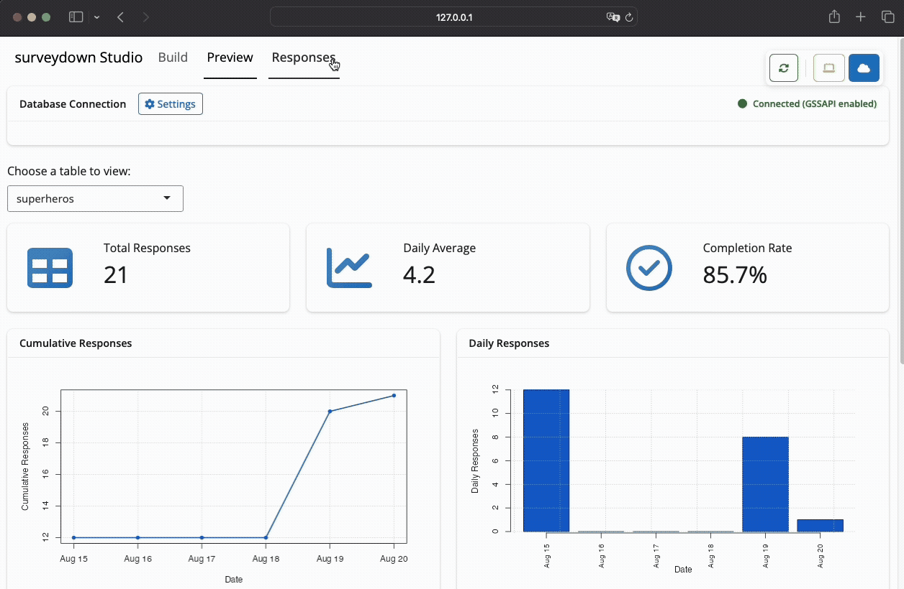
</center>

---



```{r}
#| echo: false
countdown(
  minutes = 10,
  top = 0,
  right = 0,
  font_size = '2em'
)
```

## Your turn

- Create a Supabase account and database.
- Run `surveydown::sd_db_config()` in your console to store your Supabase credentials.
- Change `mode: preview` to `mode: database` in your `survey.qmd`.
- Run your survey locally, answer questions to generate data.
- View your response data with `sdstudio::launch()`

---

# Static data fetching

Once your database is properly set up, you can fetch the data using:

```{r}
#| eval: false
db <- sd_db_connect()
data <- sd_get_data(db)
```

Or simply:

```{r}
#| eval: false
data <- sd_get_data(sd_db_connect())
```

---

## Reactive data fetching

You can also reactively fetch the data live inside the survey

In `app.R`:

::: {.col width="60%"}

```{r}
#| eval: false
#| code-line-numbers: "5"

db <- sd_db_connect()

server <- function(input, output, session) {
  data <- sd_get_data(db, refresh_interval = 5)

  sd_server(db)
}
```

:::

---

## Reactive data fetching

Use the reactive data to create some output

::: {.col width="55%"}

In `app.R`:

```{r}
#| eval: false
#| code-line-numbers: "6"

server <- function(input, output, session) {
  data <- sd_get_data(db, refresh_interval = 5)

  output$my_plot <- renderPlot({
    my_data <- data()

    # insert code here to make a plot
  })

  sd_server(db)
}
```

:::

::: {.col width="45%"}

In `survey.qmd`:

````markdown
`r ''````{r}
plotOutput("my_plot")
```
````

<br>
See the `demo-live-polling` folder

:::

---



```{r}
#| echo: false
countdown(
  minutes = 10,
  top = 0,
  right = 0,
  font_size = '2em'
)
```

## Your turn

- Use `sd_get_data(db)` to read in a copy of your survey response data.
- Edit your `app.R` file to reactively access your survey data.
- Use your data to make a plot about your data.
- Display your plot in your `survey.qmd` file with `plotOutput("my_plot")`

---

```{r}
#| echo: false
#| output: asis
agenda(5)
```

---




## Read the [chapter](https://mastering-shiny.org/basic-reactivity.html) in Mastering Shiny to<br>understand reactivity in general

<br>

## Read the surveydown [reactivity page](https://surveydown.org/docs/reactivity)<br>for reactivity in surveydown

---





# Reactivity is about changing<br>something based on respondent input

---





<center>
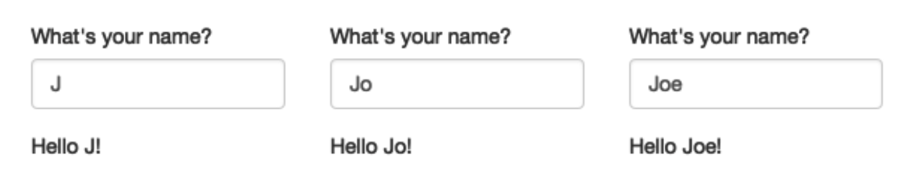
</center>

---

## Same example in surveydown

::: {.col width="45%"}

In `survey.qmd`:

````{.markdown code-line-numbers="8"}
`r ''````{r}
sd_question(
  type  = "text",
  id    = "name",
  label = "What is your name?"
)

textOutput("greeting")
```
````

:::

::: {.col width="55%"}

In `app.R`:

```{r}
#| eval: false
#| code-line-numbers: "3,4,5"

server <- function(input, output, session) {
  output$greeting <- renderText({
    paste0("Hello ", sd_value("name"), "!")
  })

  sd_server()
}
```

:::

---

## Simplified with `sd_output()` to display question values

::: {.col width="60%"}

In `survey.qmd`:

````{.markdown code-line-numbers="9"}
`r ''````{r}
sd_question(
  type  = "text",
  id    = "name",
  label = "What is your name?"
)
```

Hello, `r "\x60r sd_output(\"name\", type = \"value\")\x60"`!
````

:::

::: {.col width="40%"}

In `app.R`:

```{r}
#| eval: false

server <- function(input, output, session) {
  sd_server()
}
```

:::

---

## Understanding `sd_output()`

::: {.col}

Question in `survey.qmd`:

```{r}
#| eval: false
#| code-line-numbers: "6"

sd_question(
  type = "mc",
  id = "penguins",
  label = "What's your favorite penguin?",
  option = c(
    "Adélie" = "adelie",
    "Chinstrap" = "chinstrap",
    "Gentoo" = "gentoo"
  )
)
```

:::

::: {.col}

Display a question _value_:

```{r}
#| eval: false
sd_output("penguins", type = "value")
```

Example: `adelie`

<br>

Display a question _option label_:

```{r}
#| eval: false
sd_output("penguins", type = "label_option")
```

Example: `Adélie`

:::

---

## Understanding `sd_output()`

::: {.col}

Question in `survey.qmd`:

```{r}
#| eval: false
#| code-line-numbers: "4"

sd_question(
  type = "mc",
  id = "penguins",
  label = "What's your favorite penguin?",
  option = c(
    "Adélie" = "adelie",
    "Chinstrap" = "chinstrap",
    "Gentoo" = "gentoo"
  )
)
```

:::

::: {.col}

Display a _question label_:

```{r}
#| eval: false
sd_output("penguins", type = "label_question")
```

Example:<br>`What's your favorite penguin?`

:::

---



```{r}
#| echo: false
countdown(
  minutes = 7,
  top = 0,
  right = 0,
  font_size = '2em'
)
```

# Your turn

In your survey, display a question _value_ somewhere with:

```markdown
`r "\x60r sd_output(\"id\", type = \"value\")\x60"`
```

<br>

In your survey, display a question _option label_ somewhere with:

```markdown
`r "\x60r sd_output(\"id\", type = \"label_option\")\x60"`
```

---

## Change the question text based on respondent choices

::: {.col width="60%"}

In `survey.qmd`:

```{r}
#| eval: false

sd_question(
  id = "pet_type",
  type = "mc",
  label = "Which do you prefer, dogs or cats?",
  option = c(
    "Dogs" = "dog",
    "Cats" = "cat"
  )
)
```

:::

::: {.col width="40%"}

Follow up question:

If `dog`:

Are you a **dog** owner?

<br>

If `cat`:

Are you a **cat** owner?

:::

---

### **Solution**: Define the entire question in the server

::: {.col width="75%" .font70}

```{r}
#| eval: false

library(glue)

server <- function(input, output, session) {
  observe({
    # Trigger with any change to the pet_type question
    pet_type <- sd_value("pet_type")

    # Make the question
    sd_question(
      type = "mc",
      id = "pet_owner",
      label = glue("Are you a {pet_type} owner?"),
      option = c("Yes" = "yes", "No" = "no")
    )
  })

  # Only show the pet_owner question if pet_type is answered
  sd_show_if(
    sd_is_answered("pet_type") ~ "pet_owner"
  )

  sd_server()
}
```

:::

---

### **Solution**: Define the entire question in the server

::: {.col width="75%" .font70}

```{r}
#| eval: false
#| code-line-numbers: "5,6,7,8"

library(glue)

server <- function(input, output, session) {
  observe({
    # Trigger with any change to the pet_type question
    pet_type <- sd_value("pet_type")

    # Make the question
    sd_question(
      type = "mc",
      id = "pet_owner",
      label = glue("Are you a {pet_type} owner?"),
      option = c("Yes" = "yes", "No" = "no")
    )
  })

  # Only show the pet_owner question if pet_type is answered
  sd_show_if(
    sd_is_answered("pet_type") ~ "pet_owner"
  )

  sd_server()
}
```

:::

::: {.col width="25%"}

<br>

Use `observe()` to detect any change to the `pet_type` question

:::

---

### **Solution**: Define the entire question in the server

::: {.col width="75%" .font70}

```{r}
#| eval: false
#| code-line-numbers: "10,11,12,13,14,15"

library(glue)

server <- function(input, output, session) {
  observe({
    # Trigger with any change to the pet_type question
    pet_type <- sd_value("pet_type")

    # Make the question
    sd_question(
      type = "mc",
      id = "pet_owner",
      label = glue("Are you a {pet_type} owner?"),
      option = c("Yes" = "yes", "No" = "no")
    )
  })

  # Only show the pet_owner question if pet_type is answered
  sd_show_if(
    sd_is_answered("pet_type") ~ "pet_owner"
  )

  sd_server()
}
```

:::

::: {.col width="25%"}

<br><br><br><br><br>

Use `sd_question()` to define the question

:::

---

### **Solution**: Define the entire question in the server

::: {.col width="75%" .font70}

```{r}
#| eval: false
#| code-line-numbers: "19,20,21"

library(glue)

server <- function(input, output, session) {
  observe({
    # Trigger with any change to the pet_type question
    pet_type <- sd_value("pet_type")

    # Make the question
    sd_question(
      type = "mc",
      id = "pet_owner",
      label = glue("Are you a {pet_type} owner?"),
      option = c("Yes" = "yes", "No" = "no")
    )
  })

  # Only show the pet_owner question if pet_type is answered
  sd_show_if(
    sd_is_answered("pet_type") ~ "pet_owner"
  )

  sd_server()
}
```

:::

::: {.col width="25%"}

<br><br><br><br><br><br><br><br><br><br>

Hide the `pet_owner` question until `pet_type` is answered

:::

---

## Use `sd_output()` to display the reactive question

::: {.col width="60%"}

In `survey.qmd`:

```{r}
#| eval: false
#| code-line-numbers: "11"

sd_question(
  id = "pet_type",
  type = "mc",
  label = "Which do you prefer, dogs or cats?",
  option = c(
    "Dogs" = "dog",
    "Cats" = "cat"
  )
)

sd_output("pet_owner", type = "question")
```

See the `demo-reactive-questions` folder

:::

::: {.col width="40%"}

Follow up question:

If `dog`:

Are you a **dog** owner?

<br>

If `cat`:

Are you a **cat** owner?

:::

---



```{r}
#| echo: false
countdown(
  minutes = 10,
  top = 0,
  right = 0,
  font_size = '2em'
)
```

## Your turn

::: {.col width="70%"}

Define a question inside your server (`app.R` file):

```{r}
#| eval: false

server <- function(input, output, session) {
  observe({
    sd_question(
      type = "mc",
      id = "id",
      ...
    )
  })

  sd_server()
}
```

Display the question inside your survey (`survey.qmd` file):

```{r}
#| eval: false
sd_output("id", type = "question")
```

:::

---





# [Blog post on conjoint in surveydown](https://surveydown.org/blog/2024-08-28-choice-based-conjoint-surveys-with-surveydown/)

::: {.fragment}
# Sign up for meeting slot next week<br>(link in #project channel)
:::
