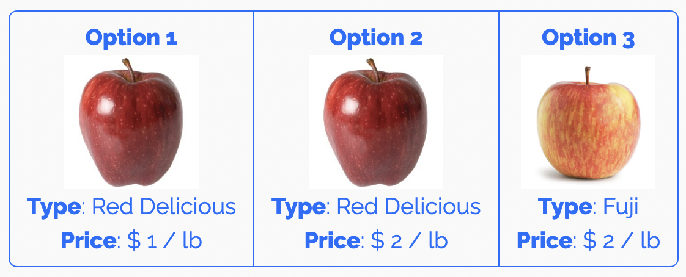
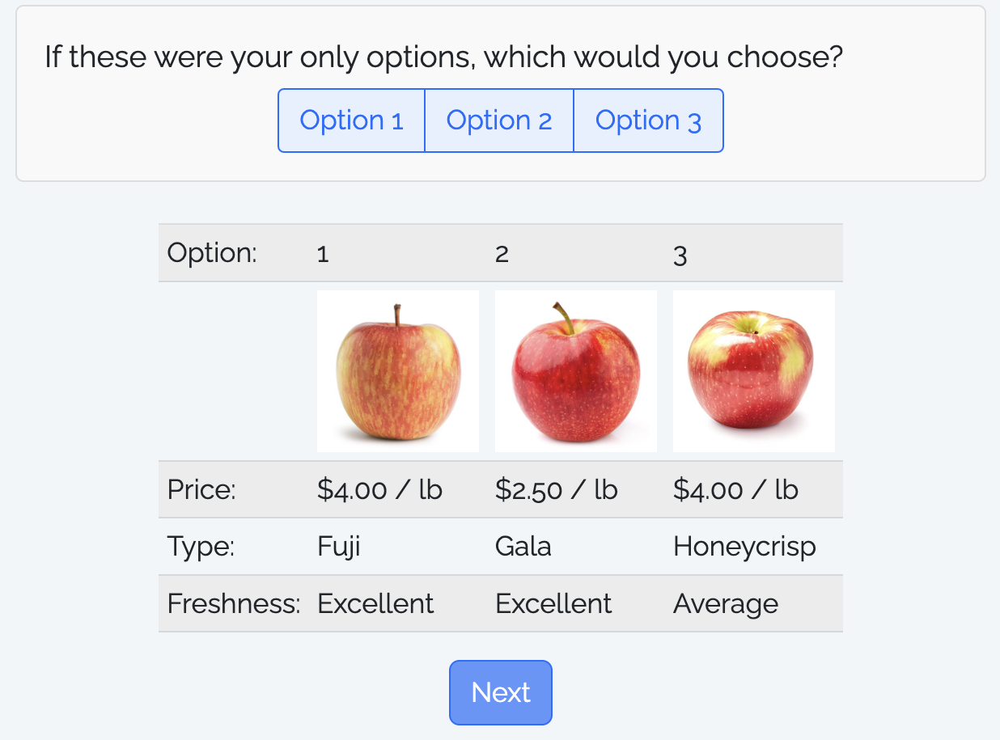



```{r}
#| include: false

library(cbcTools)
library(surveydown)
library(glue)
set.seed(123)

# Define profiles with attributes and levels
# (this matches the conjoint_buttons / conjoint_tables templates)
profiles <- cbc_profiles(
  type = c("Fuji", "Gala", "Honeycrisp", "Pink Lady", "Red Delicious"),
  price = seq(1, 4, 0.5), # Price ($ / lb)
  freshness = c("Excellent", "Average", "Poor")
)

# Make a basic full-factorial design of experiment
design <- cbc_design(
  profiles = profiles,
  n_resp = 2000, # Number of respondents
  n_alts = 3, # Number of alternatives per question
  n_q = 6 # Number of questions per respondent
)

# A second set of profiles with an extra "sourcing" attribute, used to
# illustrate labeled designs, restrictions, and balance_by
profiles2 <- cbc_profiles(
  type = c("Fuji", "Gala", "Honeycrisp"),
  price = seq(1, 4, 0.5),
  sourcing = c("Local", "Imported"),
  milesTraveled = c(50, 500, 1500, 3000)
)

# Make a labeled full-factorial design of experiment
design_labeled <- cbc_design(
  profiles = profiles2,
  n_resp = 500, # Number of respondents
  n_alts = 2, # Number of alternatives per question (= # of label levels)
  n_q = 6, # Number of questions per respondent
  label = "sourcing"
)

# Make a survey with no choice option
design_no_choice <- cbc_design(
  profiles = profiles,
  n_resp = 2000, # Number of respondents
  n_alts = 3, # Number of alternatives per question
  n_q = 6, # Number of questions per respondent
  no_choice = TRUE
)

# "milesTraveled" only makes sense for imported apples, so restrict local
# apples to the lowest ("~0") value
profiles2_restricted <- cbc_restrict(
  profiles2,
  sourcing == "Local" & milesTraveled > 50
)

# Restricting creates an imbalance: "Imported" apples have more valid
# attribute combinations left, so they get sampled more often
design_restricted <- cbc_design(
  profiles = profiles2_restricted,
  n_resp = 500,
  n_alts = 2,
  n_q = 6
)

# Fix the imbalance with balance_by
design_balanced <- cbc_design(
  profiles = profiles2_restricted,
  n_resp = 500,
  n_alts = 2,
  n_q = 6,
  balance_by = "sourcing"
)

design_short <- design %>%
  mutate(
    price = scales::dollar(price)
  ) %>%
  select(
    respID,
    qID,
    `Option:` = altID,
    `Type:` = type,
    `Price:` = price,
    `Freshness:` = freshness
  ) %>%
  as.data.frame()
design_labeled_short <- design_labeled %>%
  mutate(
    price = scales::dollar(price),
    milesTraveled = paste0(milesTraveled, " mi")
  ) %>%
  select(
    respID,
    qID,
    `Option:` = sourcing,
    `Type:` = type,
    `Price:` = price,
    `Miles traveled:` = milesTraveled
  ) %>%
  as.data.frame()
design_no_choice_short <- design_no_choice %>%
  mutate(
    type = as.character(type),
    freshness = as.character(freshness),
    price = scales::dollar(price),
    price = ifelse(altID == 4, "", price),
    type = ifelse(altID == 4, "", type),
    freshness = ifelse(altID == 4, "", freshness),
    altID = ifelse(altID == 4, "None", altID)
  ) %>%
  select(
    respID,
    qID,
    `Option:` = altID,
    `Type:` = type,
    `Price:` = price,
    `Freshness:` = freshness
  ) %>%
  as.data.frame()
row.names(design_no_choice_short) <- seq(nrow(design_no_choice_short))
design_q1 <- design_short %>%
  filter(respID == 1, qID == 1) %>%
  select(-respID, -qID)
design_q2 <- design_short %>%
  filter(respID == 1, qID == 2) %>%
  select(-respID, -qID)
design_labeled_q1 <- design_labeled_short %>%
  filter(respID == 1, qID == 1) %>%
  select(-respID, -qID)
design_labeled_q2 <- design_labeled_short %>%
  filter(respID == 1, qID == 2) %>%
  select(-respID, -qID)
design_no_choice_q1 <- design_no_choice_short %>%
  filter(respID == 1, qID == 1) %>%
  select(-respID, -qID)
design_no_choice_q2 <- design_no_choice_short %>%
  filter(respID == 1, qID == 2) %>%
  select(-respID, -qID)

agenda_items <- c(
  "Defining choice questions in R",
  "Displaying choice questions in surveydown"
)
```

---





# Some Quarto tips

---

### [Convert a data frame to a markdown table with `kable()`]{.center}

. . .

```{r}
#| eval: false
library(tidyverse)

mtcars %>%
  kable()
```

. . .

::: {.font80}

```{r}
#| echo: false
mtcars %>%
  kable()
```

:::

---

### [Example from last year]{.center}

```{r}
#| eval: false
library(tidyverse)

df <- read_csv("competitors.csv")
df %>%
  kable()
```

::: {.font80}

```{r}
#| echo: false
library(tidyverse)

df <- read_csv("competitors.csv")
df %>%
  kable()
```

:::

---




# More `kable()` formatting options:<br>[{kableExtra} package](https://cran.r-project.org/web/packages/kableExtra/vignettes/awesome_table_in_html.html)

---

# References

**Simple approach**: Insert a footnote with `^[]`

::: {.col}

### This markdown...

`The Eiffel Tower is 324 meters tall^[From the [Eiffel Tower wikipedia page](https://en.wikipedia.org/wiki`<br>`/Eiffel_Tower)]`

:::

::: {.col}

### ...renders as this

The Eiffel Tower is 324 meters tall<sup>1</sup>

[<sup>1</sup>From the [Eiffel Tower wikipedia page](https://en.wikipedia.org/wiki/Eiffel_Tower)]{.font70}

:::

---

# References

**Complex (but more complete) approach**: Use bibtex

<https://quarto.org/docs/authoring/footnotes-and-citations.html>

You can insert citations with `[@citekey]`, and a "References" table will be automatically created.

. . .

<br>

**Footnotes are perfectly fine for this class**

---

```{r}
#| echo: false
#| output: asis
agenda(0)
```

---

```{r}
#| echo: false
#| output: asis
agenda(1)
```

---




# 1. Download today's notes, then

# 2. Open the `conjoint_buttons` folder in Positron

---

## [We'll be using the [{cbcTools} package](https://jhelvy.github.io/cbcTools/) today]{.center}

<br>

Install with:

```{r}
#| eval: false
remotes::install_github("jhelvy/cbcTools")
```

---

# Choice question components

<br>

### 1. Generate `profiles` for each attribute and level

### 2. Create a survey `design` data frame from `profiles`

---



# Basic Design

Any combination of attributes can be shown in each choice question

::: {.col .font90}

## Question 1

```{r}
#| echo: false
kable(t(design_q1))
```

:::

::: {.col .font90}

## Question 2

```{r}
#| echo: false
kable(t(design_q2))
```

:::

---

# [This is exactly what's in]{.center}<br>[`code/1_make_choice_questions.R`]{.center}

::: {.font80}

```{r}
#| eval: false
profiles <- cbc_profiles(
  type = c("Fuji", "Gala", "Honeycrisp", "Pink Lady", "Red Delicious"),
  price = seq(1, 4, 0.5), # Price ($ / lb)
  freshness = c("Excellent", "Average", "Poor")
)

design <- cbc_design(
  profiles = profiles,
  n_resp = 2000, # Number of respondents
  n_alts = 3, # Number of alternatives per question
  n_q = 6 # Number of questions per respondent
)
```

:::

---



```{r}
#| echo: false
countdown(
  minutes = 15,
  warn_when = 10,
  update_every = 1,
  top = "0.5em",
  right = "0.5em",
  font_size = '2em'
)
```

## Your Turn

## Open the `conjoint_buttons` template folder in Positron

In `code/1_make_choice_questions.R`, replace the apple `profiles` with your own team's attributes and levels

Leave `cbc_design()` at its default values for now - just get a basic design of your own running

---





# Three design choices to consider

---

# [Three design choices to consider]{.center}

<br>

### 1. Regular or labeled?

### 2. Include a "none" option (outside good) or not?

### 3. Include restrictions?

---



# 1. Regular or labeled?

A **labeled** design fixes one attribute to a specific option position<br>e.g. Option 1 is always "Local", option 2 is always "Imported"

::: {.col .font90}

## Question 1

```{r}
#| echo: false
kable(t(design_labeled_q1))
```

:::

::: {.col .font90}

## Question 2

```{r}
#| echo: false
kable(t(design_labeled_q2))
```

:::

---

# [Code: labeled design]{.center}

::: {.font80}

```{r}
#| eval: false
design_labeled <- cbc_design(
  profiles = profiles,
  n_resp = 500,
  n_alts = 2, # must equal the # of levels in the label attribute
  n_q = 6,
  label = "sourcing"
)
```

:::

Use a labeled design when respondents are really comparing **named alternatives** (brands, powertrains, sourcing...) rather than unlabeled bundles of attributes

---



# 2. Include a "none" option?

A "none" option lets respondents say "I wouldn't buy any of these"

::: {.col .font80}

## Question 1

```{r}
#| echo: false
kable(t(design_no_choice_q1))
```

:::

::: {.col .font80}

## Question 2

```{r}
#| echo: false
kable(t(design_no_choice_q2))
```

:::

---

# [Code: a "none" option]{.center}

::: {.font80}

```{r}
#| eval: false
design_no_choice <- cbc_design(
  profiles = profiles,
  n_resp = 2000,
  n_alts = 3,
  n_q = 6,
  no_choice = TRUE
)
```

:::

Without this, respondents are forced to pick one of the alternatives shown, even if they wouldn't choose any of them in real life

---

# [Attribute-specific features]{.center}

Some attributes may only be valid for certain levels of other attributes

> **Example**: "Miles traveled" only makes sense for **imported** apples (locally grown apples don't really have a meaningful travel distance).

. . .

<br>

To implement this, add restrictions to your `profiles` with `cbc_restrict()`

---

# [Code: restrictions]{.center}

::: {.font70}

```{r}
#| eval: false
profiles <- cbc_profiles(
  type = c("Fuji", "Gala", "Honeycrisp"),
  price = seq(1, 4, 0.5),
  sourcing = c("Local", "Imported"),
  milesTraveled = c(50, 500, 1500, 3000)
)

# Local apples only get the lowest ("~0") miles traveled value
profiles_restricted <- profiles %>%
  cbc_restrict(
    sourcing == "Local" & milesTraveled > 50
  )
```

:::

---

# [Warning]{.red}: Restrictions can lead to imbalances

Design the questions from the restricted profiles...

```{r}
#| eval: false
design_restricted <- cbc_design(
  profiles = profiles_restricted,
  n_resp = 500,
  n_alts = 2,
  n_q = 6
)
```

```{r}
#| echo: false
table(design_restricted$sourcing)
```

"Imported" apples show up far more often, since they have more valid attribute combinations left after restricting

---

# Fix imbalances with `balance_by`

```{r}
#| eval: false
design_balanced <- cbc_design(
  profiles = profiles_restricted,
  n_resp = 500,
  n_alts = 2,
  n_q = 6,
  balance_by = "sourcing"
)
```

```{r}
#| echo: false
table(design_balanced$sourcing)
```

Now "Local" and "Imported" show up about equally often

---



```{r}
#| echo: false
countdown(
  minutes = 20,
  warn_when = 15,
  update_every = 1,
  top = "0.5em",
  right = "0.5em",
  font_size = '2em'
)
```

## Your Turn

With your team, discuss the specific choice question design for your project

- Regular or labeled?
- Include a "none" option (outside good) or not?
- Include restrictions?

Then update `code/1_make_choice_questions.R` to match

---

```{r}
#| echo: false
#| output: asis
agenda(2)
```

---

# [Displaying choice questions in your survey]{.center}

### 1. Read in the design file (`choice_questions.csv`)
### 2. Sample and store a random respondent ID
### 3. Filter the design for the respondentID
### 4. Define a function to create question options
### 5. Create the options for each choice question
### 6. Create each choice question (6 in total)

---

### 1. Read in the design file (`choice_questions.csv`)

```{r}
design <- readr::read_csv("choice_questions.csv")
```

---

### 2. Sample and store a random respondent ID

Sample a random respondentID

```{r}
respondentID <- sample(design$respID, 1)
```

Store the respondentID

```{r}
#| eval: false

sd_store_value(respondentID, "respID")
```

In your survey data, you will have a `respID` column

---

### 3. Filter the design for the respondentID

```{r}
df <- design %>%
  filter(respID == respondentID) %>%
  mutate(image = paste0("images/", image))
```

Images are stored in `"images"` folder, so we paste on that path

. . .

Result looks like this:

```{r}
head(df)
```

---

::: {.col}

### 4. Define a function to create question options

:::

::: {.col .font60}

```{r}
make_cbc_options <- function(df) {
  alt1 <- df |> filter(altID == 1)
  alt2 <- df |> filter(altID == 2)
  alt3 <- df |> filter(altID == 3)

  options <- c("option_1", "option_2", "option_3")

  names(options) <- c(
    glue(
      "
      **Option 1**<br>
      <br>
      **Type**: {alt1$type}<br>
      **Price**: $ {alt1$price} / lb
    "
    ),
    glue(
      "
      **Option 2**<br>
      <br>
      **Type**: {alt2$type}<br>
      **Price**: $ {alt2$price} / lb
    "
    ),
    glue(
      "
      **Option 3**<br>
      <br>
      **Type**: {alt3$type}<br>
      **Price**: $ {alt3$price} / lb
    "
    )
  )
  return(options)
}
```

:::

---

::: {.col}

### 4. Define a function to create question options

Make one-row data frames for each alternative.

For example, `alt1` looks like this:

::: {.font80}
```{r}
#| echo: false

alt1 <- df %>%
  filter(qID == 1) %>%
  filter(altID == 1)

glimpse(alt1)
```
:::
:::

::: {.col .font60}

```{r}
#| eval: false

make_cbc_options <- function(df) {
  alt1 <- df |> filter(altID == 1)
  alt2 <- df |> filter(altID == 2)
  alt3 <- df |> filter(altID == 3)

  options <- c("option_1", "option_2", "option_3")

  names(options) <- c(
    glue(
      "
      **Option 1**<br>
      <br>
      **Type**: {alt1$type}<br>
      **Price**: $ {alt1$price} / lb
    "
    ),
    glue(
      "
      **Option 2**<br>
      <br>
      **Type**: {alt2$type}<br>
      **Price**: $ {alt2$price} / lb
    "
    ),
    glue(
      "
      **Option 3**<br>
      <br>
      **Type**: {alt3$type}<br>
      **Price**: $ {alt3$price} / lb
    "
    )
  )
  return(options)
}
```

:::

---

::: {.col}

### 4. Define a function to create question options

::: {.font80}
```{r}
alt1[c('image', 'type', 'price')]
```
:::

Renders as:

::: {.font80}
```{r}
#| echo: false

cat(glue(
  "
  **Option 1**<br>
  <br>
  **Type**: {alt1$type}<br>
  **Price**: $ {alt1$price} / lb
"
))
```
:::
:::

::: {.col .font60}

```{r}
#| eval: false

make_cbc_options <- function(df) {
  alt1 <- df |> filter(altID == 1)
  alt2 <- df |> filter(altID == 2)
  alt3 <- df |> filter(altID == 3)

  options <- c("option_1", "option_2", "option_3")

  names(options) <- c(
    glue(
      "
      **Option 1**<br>
      <br>
      **Type**: {alt1$type}<br>
      **Price**: $ {alt1$price} / lb
    "
    ),
    glue(
      "
      **Option 2**<br>
      <br>
      **Type**: {alt2$type}<br>
      **Price**: $ {alt2$price} / lb
    "
    ),
    glue(
      "
      **Option 3**<br>
      <br>
      **Type**: {alt3$type}<br>
      **Price**: $ {alt3$price} / lb
    "
    )
  )
  return(options)
}
```

:::

---

### 5. Create the options for each choice question

```{r}
cbc1_options <- make_cbc_options(df |> filter(qID == 1))
```

Value stored in your data:

```{r}
#| echo: false

cat(cbc1_options[1])
```

::: {.col}

Label:

```{r}
#| echo: false

names(cbc1_options[1])
```

:::

::: {.col}

Renders as:

```{r}
#| echo: false

htmltools::HTML(names(cbc1_options[1]))
```

:::

---

### 5. Create the options for each choice question

Now make the options for each question

```{r}
cbc1_options <- make_cbc_options(df |> filter(qID == 1))
cbc2_options <- make_cbc_options(df |> filter(qID == 2))
cbc3_options <- make_cbc_options(df |> filter(qID == 3))
cbc4_options <- make_cbc_options(df |> filter(qID == 4))
cbc5_options <- make_cbc_options(df |> filter(qID == 5))
cbc6_options <- make_cbc_options(df |> filter(qID == 6))
```

---

### 6. Create each choice question (6 in total)

::: {.col}

Code:

::: {.font80}
```{r}
#| eval: false

sd_question(
  type = 'mc_buttons',
  id = 'cbc_q1',
  label = "(1 of 6) If these were your only options, which would you choose?",
  option = cbc1_options
)
```
:::
:::

::: {.col}

Renders as:

<center>

</center>

:::

---

## [TABLE layout: Show options in a table with `kable()`]{.center}

::: {.font80}
```{r}
library(dplyr)

alts <- df %>%
  filter(qID == 1) %>%
  mutate(
    # Add $ sign to price and html code for image path
    price = paste(scales::dollar(price), "/ lb"),
    image = paste0('')
  ) %>%
  # Make nicer attribute labels
  select(
    `Option:` = altID,
    ` ` = image,
    `Price:` = price,
    `Type:` = type,
    `Freshness:` = freshness
  )

# Drop row names
row.names(alts) <- NULL
```
:::

---

## [Option: Show options in a table with `kable()`]{.center}

Display the _transpose_, `t(alts)`

::: {.font80}
```{r}
kbl(t(alts), escape = FALSE) %>%
  kable_styling(
    bootstrap_options = c("striped", "hover", "condensed"),
    full_width = FALSE,
    position = "center"
  )
```
:::

---



## [TABLE layout: Show options in a table with `kable()`]{.center}

Your choice question can be defined in the `survey.qmd`<br>file as it is just choosing one of three options:

<center>

</center>

---



```{r}
#| echo: false
countdown(
  minutes = 20,
  warn_when = 15,
  update_every = 1,
  top = "0.5em",
  right = "0.5em",
  font_size = '2em'
)
```

## Your Turn

With your team, choose a format to work with (buttons or table) for your choice question, then modify the example survey to match your project.

<br>

## Versions:

## Buttons layout: `conjoint_buttons`

## Table layout: `conjoint_tables`
