

```{r}
#| include: false

abbs <- read_csv(file.path('data', 'state_abbs.csv'))

agenda_items <- c(
  "Maximum likelihood estimation",
  "Optimization (in general)",
  "Joins",
  "Pilot data cleaning"
)
```

---



# Quiz 3

```{r}
#| echo: false
countdown(
  minutes      = 12,
  warn_when    = 30,
  update_every = 1,
  top          = 0,
  right        = 0,
  font_size    = '3em'
)
```

::: {.col}

## Write your name on the quiz!

## Rules:

- Work alone; no outside help of any kind is allowed.
- No calculators, no notes, no books, no computers, no phones.

:::

::: {.col}

<br>
<center>

</center>

:::

---

```{r}
#| echo: false
#| output: asis
agenda(0)
```

---

```{r}
#| echo: false
#| output: asis
agenda(1)
```

---



## [Computing the likelihood]{.center}

::: {.col}

<center>
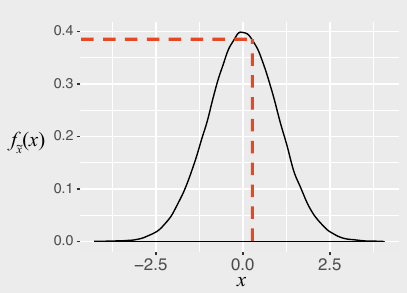
</center>

:::

::: {.col}

$x$: an observation

$f(x)$: probability of observing $x$

:::

---



## [Computing the likelihood]{.center}

::: {.col}

<center>

</center>

:::

::: {.col}

$x$: an observation

$f(x)$: probability of observing $x$

$\mathcal{L}(\theta | x)$: probability that $\theta$ are the true parameters, given that observed $x$

**We want to estimate $\theta$**

:::

---




## We actually compute the _log_-likelihood<br>(converts multiplication to addition)

<center>
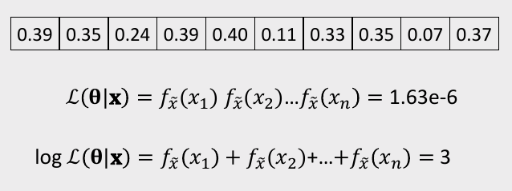
</center>

---



# Practice Question 1

**Observations** - Height of students (inches):

```{r}
#| echo: false
x <- c(65, 69, 66, 67, 68, 72, 68, 69, 63, 70)
x
```

a) Let's say we know that the height of students, $\tilde{x}$, in a classroom follows a normal distribution. A professor obtains the above height measurements students in her classroom. What is the log-likelihood that $\tilde{x} \sim \mathcal{N} (68, 4)$? In other words, compute $\ln \mathcal{L} (\mu = 68, \sigma = 4)$.

. . .

b) Compute the log-likelihood function using the same standard deviation $(\sigma = 4)$ but with the following different values for the mean, $\mu: 66, 67, 68, 69, 70$. How do the results compare? Which value for $\mu$ produces the highest log-likelihood?

---

```{r}
#| echo: false
#| output: asis
agenda(2)
```

---





::: {.col width="40%"}

# $f(x)$

:::

::: {.col width="60%"}

<center>
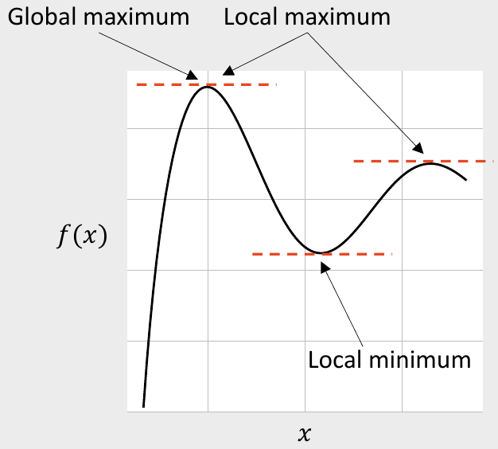
</center>

:::

---





::: {.col width="40%"}

<center>
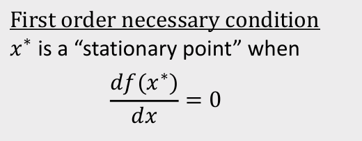
</center>

:::

::: {.col width="60%"}

<center>

</center>

:::

---





::: {.col width="40%"}

<center>
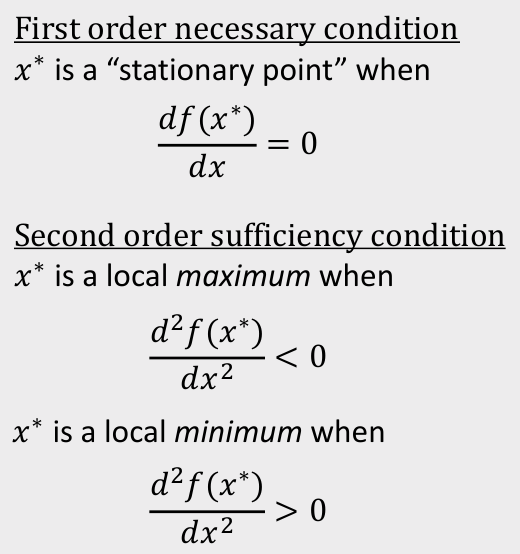
</center>

:::

::: {.col width="60%"}

<center>

</center>

:::

---





<center>
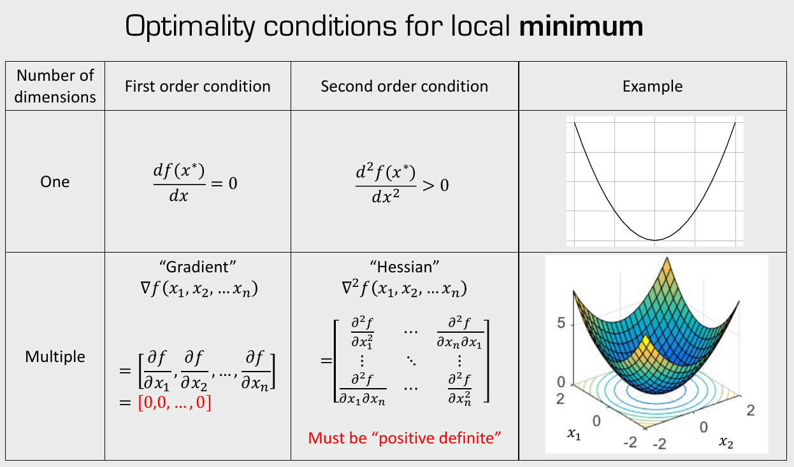
</center>

---





<center>

</center>

---



# Practice Question 2

::: {.col width="80%"}

Consider the following function:

$$f(x) = x^2 - 6x$$

The gradient is:

$$\nabla f(x) = 2x - 6$$

Using the starting point $x = 1$ and the step size $\gamma =  0.3$, apply the gradient descent method to compute the next **three** points in the search algorithm.

:::

---





<center>

</center>

---



# Practice Question 3

::: {.col width="80%"}

Consider the following function:

$$
f(\underline{x}) = x_1^2 + 4x_2^2
$$

The gradient is:

$$
\nabla f(\underline{x}) =
\begin{bmatrix}
2x_1
\\
8x_2
\end{bmatrix}
$$

Using the starting point $\underline{x}_0 = [1, 1]$ and the step size $\gamma =  0.15$, apply the gradient descent method to compute the next **three** points in the search algorithm.

:::

---




## Download the [logitr-cars](https://github.com/jhelvy/logitr-cars/archive/refs/heads/main.zip) repo from GitHub

---

# [Estimating utility models]{.center}

<br>

::: {.col width="80%"}

## 1. Open the `logitr-cars` folder in Positron

## 2. Open `code/3.1-model-mnl.R`

:::

---



# Maximum likelihood estimation

::: {.col}

<center>
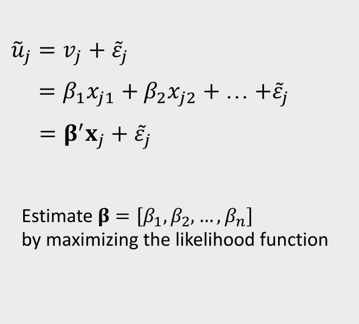
</center>

:::

::: {.col}

<center>
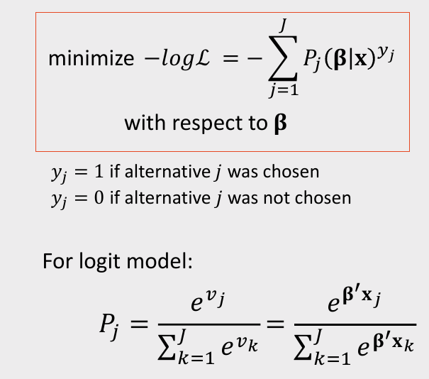
</center>

:::

---




# [Break]{.fancy}

```{r}
#| echo: false
countdown(
  minutes      = 5,
  warn_when    = 30,
  update_every = 1,
  left         = 0, right = 0, top = 1, bottom = 0,
  margin       = "5%",
  font_size    = "8em"
)
```

---

```{r}
#| echo: false
#| output: asis
agenda(3)
```

---



## What's wrong with this map?

<center>
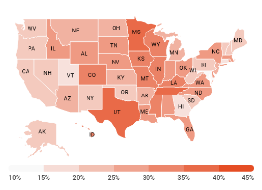
</center>

---

### Likely culprit: Merging two columns

::: {.col}

```{r}
#| echo: false
names <- data.frame(state_name = sort(abbs$state_name))
abbs  <- data.frame(state_abb = sort(abbs$state_abb))
```
```{r}
head(names)
head(abbs)
```

:::

::: {.col .fragment}

```{r}
result <- cbind(names, abbs)
head(result)
```

:::

---

## Joins

1. `inner_join()`
2. `left_join()` / `right_join()`
3. `full_join()`

. . .

Example: `band_members` & `band_instruments`

::: {.col}

```{r}
band_members
```

:::

::: {.col}

```{r}
band_instruments
```

:::

---

::: {.col}

## `inner_join()`

```{r}
band_members %>%
    inner_join(band_instruments)
```

:::

::: {.col}

<br>
<center>

</center>

:::

---

::: {.col}

## `full_join()`

```{r}
band_members %>%
    full_join(band_instruments)
```

:::

::: {.col}

<br>
<center>
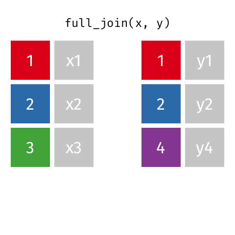
</center>

:::

---

::: {.col}

## `left_join()`

```{r}
band_members %>%
    left_join(band_instruments)
```

:::

::: {.col}

<br>
<center>
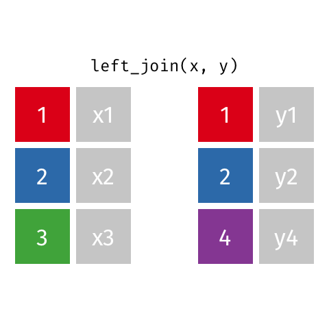
</center>

:::

---

::: {.col}

## `right_join()`

```{r}
band_members %>%
    right_join(band_instruments)
```

:::

::: {.col}

<br>
<center>

</center>

:::

---

## Specify the joining variable name

::: {.col}

```{r}
#| message: true
band_members %>%
    left_join(band_instruments)
```

:::

::: {.col .fragment}

```{r}
#| message: true
#| code-line-numbers: "3"
band_members %>%
    left_join(band_instruments,
              by = 'name')
```

:::

---

## Specify the joining variable name

If the names differ, use `by = c("left_name" = "joining_name")`

. . .

::: {.col}

```{r}
band_members
```
```{r}
band_instruments2
```

:::

::: {.col .fragment}

```{r}
#| code-line-numbers: "3"
band_members %>%
    left_join(band_instruments2,
              by = c("name" = "artist"))
```

:::

---

## Specify the joining variable name

Or just rename the joining variable in a pipe

::: {.col}

```{r}
band_members
```
```{r}
band_instruments2
```

:::

::: {.col}

```{r}
#| code-line-numbers: "2,4"
band_members %>%
    rename(artist = name) %>%
    left_join(band_instruments2,
              by = "artist")
```

:::

---



```{r}
#| echo: false
countdown(
    minutes      = 15,
    warn_when    = 15,
    update_every = 1,
    top          = 0,
    right        = 0,
    font_size    = '2em'
)
```

## Your turn

::: {.col .font80}

1) Create a new data frame called `state_data` by joining the `state_abbs` and `state_regions` data frames. The result should be a data frame with variables `state_name`, `state_abb`, and `state_region`. It should look like this:

::: {.font70}

```{r}
#| include: false
state_abbs <- read_csv(file.path('data', 'state_abbs.csv'))
state_regions <- read_csv(file.path('data', 'state_regions.csv'))
wildlife_impacts <- read_csv(file.path('data', 'wildlife_impacts.csv'))

state_data <- state_abbs %>%
    left_join(state_regions, by = c('state_name' = 'state')) %>%
    rename(state_region = region)
```

```{r}
head(state_data)
```

:::

:::

::: {.col .font80}

2) Join the `state_data` data frame to the `wildlife_impacts` data frame, adding the variables `state_region` and `state_name`.

```{r}
#| include: false
wildlife_impacts2 <- wildlife_impacts %>%
    mutate(state = ifelse(state == 'N/A', NA, state)) %>%
    left_join(state_data, by = c('state' = 'state_abb')) %>%
    select(state_abb = state, state_name, state_region, everything())
```

::: {.font50}

```{r}
#| eval: false
glimpse(wildlife_impacts)
```

```{r}
#| echo: false
glimpse(wildlife_impacts2)
```

:::

:::

---

```{r}
#| echo: false
#| output: asis
agenda(4)
```

---




## Download the [conjoint_buttons](https://github.com/surveydown-dev/template_conjoint_buttons/archive/refs/heads/main.zip) template repo

---

# [Cleaning surveydown survey data]{.center}

<br>

::: {.col width="80%"}

## 1. Open the `survey` folder in Positron

## 2. Open `code/3_data_cleaning.R`

:::

---



## Team time

::: {.col width="80%"}

### For the rest of class, work with your team to finalize your pilot surveys and get them live!

:::
